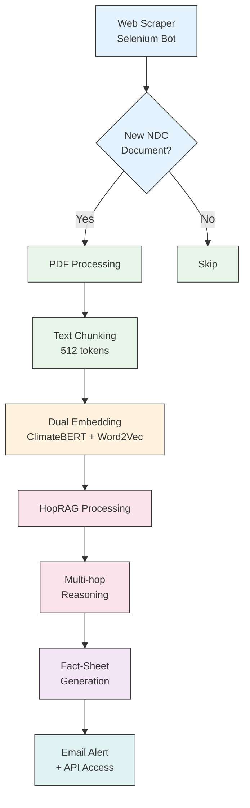
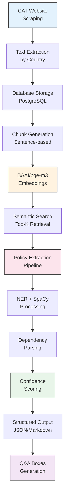
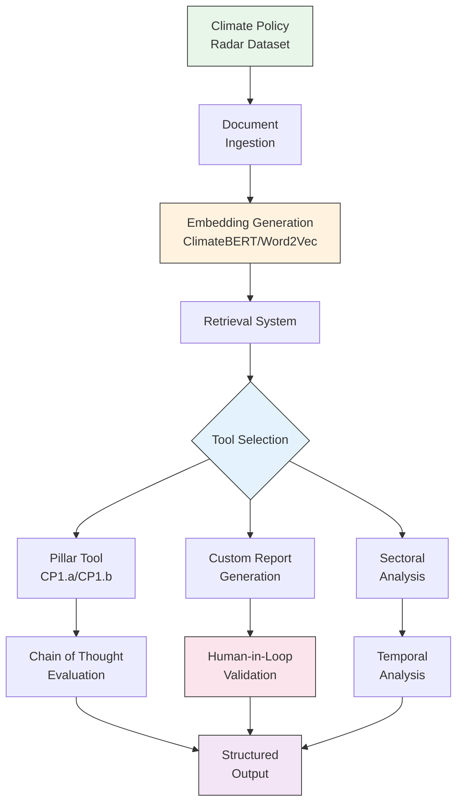

# RAG Climate Fact Sheets 

## Overview 

This repository contains the collective work of three groups from the DS205 course that developed automated RAG-based systems for extracting, analysing, and synthesising climate policy data from different authoritative sources. Each group adopted distinct approaches and tackled unique challenges in processing climate policy documents that together form a comprehensive framework for automating climate policy analysis.

## 🌐 UNFCCC NDC Analysis (`rag_unfccc`)
- Source: UNFCCC Nationally Determined Contributions (NDCs)
- Focus: Automated monitoring and standardised fact-sheet generation for newly published NDC documents
- Key Innovation: HopRAG architecture for multi-hop reasoning in complex policy documents

## 🎯 Climate Action Tracker Analysis (`rag_cat`)
- Source: ClimateActionTracker.org
- Focus: Structured extraction of policy targets with confidence scoring
- Key Innovation: Hybrid NLP pipeline combining NER, dependency parsing, and semantic similarity

## 📊 Climate Policy Radar Dataset Analysis (`rag_policy_radar`)
- Source: Climate Policy Radar Database
- Focus: ASCOR methodology implementation for systematic climate legislation assessment
- Key Innovation: Multi-tier LLM strategy with human-in-the-loop validation

