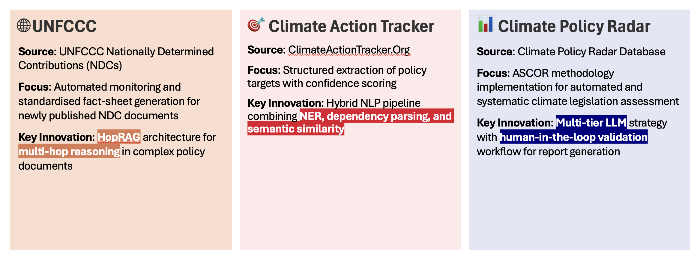
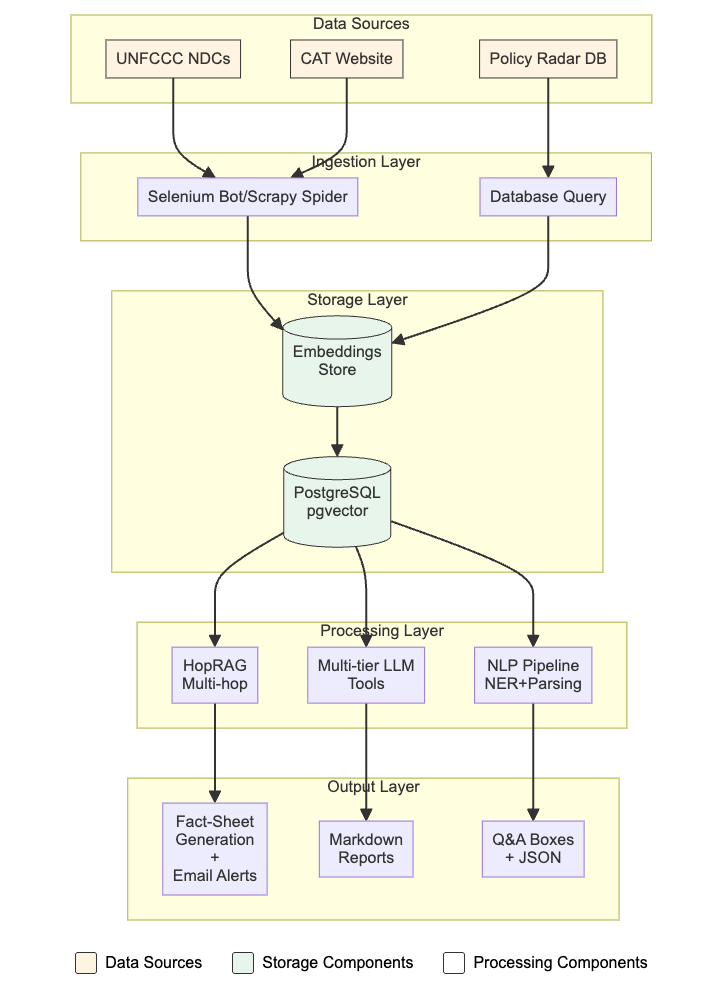

# RAG Climate Fact Sheets 
<!-- ALL-CONTRIBUTORS-BADGE:START - Do not remove or modify this section -->

<!-- ALL-CONTRIBUTORS-BADGE:END -->

## Overview 

This repository contains the collective work of three groups from the DS205 course that developed automated RAG-based systems for extracting, analysing, and synthesising climate policy data from different authoritative sources. Each group adopted distinct approaches and tackled unique challenges in processing climate policy documents that together form a comprehensive framework for automating climate policy analysis.

## Summarised Workflow

Below is a summary of the solutions by the 3 groups, and a comparison of their particular approaches for each stage of the task. This also serves as a potential system design that integrates the 3 solutions into a unified workflow for automated climate policy analysis.  

## Detailed Workflows for Each Group 

### 🌐 UNFCCC NDC Analysis (`rag_unfccc`)

### 🎯 Climate Action Tracker Analysis (`rag_cat`)

### 📊 Climate Policy Radar Dataset Analysis (`rag_policy_radar`)

## Contributors ✨

Thanks goes to these wonderful people ([emoji key](https://allcontributors.org/docs/en/emoji-key)):

<!-- ALL-CONTRIBUTORS-LIST:START - Do not remove or modify this section -->
<!-- prettier-ignore-start -->
<!-- markdownlint-disable -->
<table>
  <tbody>
    <tr>
      <td align="center" valign="top" width="14.28%"><a href="https://github.com/ruikai30"> <b>ruka</b></a> <a href="https://github.com/LSE DS205/rag-fact-sheets/commits?author=ruikai30" title="Code">💻</a></td>
      <td align="center" valign="top" width="14.28%"><a href="https://github.com/Nayrbnat"> <b>Nayrbnat</b></a> <a href="https://github.com/LSE DS205/rag-fact-sheets/commits?author=Nayrbnat" title="Code">💻</a></td>
      <td align="center" valign="top" width="14.28%"><a href="https://github.com/datascraper758"> <b>datascraper758</b></a> <a href="https://github.com/LSE DS205/rag-fact-sheets/commits?author=datascraper758" title="Code">💻</a></td>
      <td align="center" valign="top" width="14.28%"><a href="https://github.com/sumayyamanji"> <b>sumayyamanji</b></a> <a href="https://github.com/LSE DS205/rag-fact-sheets/commits?author=sumayyamanji" title="Code">💻</a></td>
      <td align="center" valign="top" width="14.28%"><a href="https://github.com/felix-brown"> <b>Felix Brown</b></a> <a href="https://github.com/LSE DS205/rag-fact-sheets/commits?author=felix-brown" title="Code">💻</a></td>
    </tr>
  </tbody>
</table>

<!-- markdownlint-restore -->
<!-- prettier-ignore-end -->

<!-- ALL-CONTRIBUTORS-LIST:END -->

This project follows the [all-contributors](https://github.com/all-contributors/all-contributors) specification. Contributions of any kind welcome!