# RAG-Fact-Sheet (Group 4)

## 🌟 Project Overview

The RAG-Fact-Sheet system is an **automated data pipeline** that periodically monitors the official UNFCCC website for newly published **Nationally Determined Contribution (NDC)** documents. Upon detecting a new release, the system triggers a workflow to extract, process, and analyze the content, culminating in the generation of a **standardized summary report** resembling a predefined fact-sheet format.

### Key Features

* **🔗 Multi-Hop Reasoning**: HopRAG architecture enables complex question answering by traversing semantic relationships between document chunks
* **🌍 Multi-lingual Transformer Embeddings**: Our RAG architecture allows for multilingual interpretation and support
* **✅ Robust Validation**: Multi-tier scoring and validation framework ensures high accuracy and low hallucination rates
* **📄 Automated Report Generation**: HTML/PDF report generation with email delivery system for stakeholder notifications

### Technical Innovations

* **⚖️ Confidence-Based Workflow**: Dual validation enables analysts to focus on **low/medium confidence responses**
* **🔍 Hybrid Similarity Search**: `Similarity` combined with `Fuzzy Regex` and `Regex` optimizes both lexical and semantic retrieval
* **🧠 Domain-Aware Prompting**: Keyword mapping leverages climate policy expertise for enhanced response quality
* **🕸️ hopRAG Architecture**: Novel multi-hop reasoning framework that efficiently connects related document chunks

For more details about the project architecture and design decisions, please refer to the [full project report](REPORT.md).

## 🔧 Setup & Installation Instructions

### Prerequisites

- Python 3.10+
- PostgreSQL with pgvector extension
- Tesseract OCR (for PDF extraction)
- Docker (recommended for database setup if you intend to run locally)
- Supabase (if you want to use cloud)

### Initial Setup

1. **Clone the repository**
   ```bash
   git clone https://github.com/yourusername/rag-fact-sheets-4.git
   cd rag-fact-sheets-4
   ```

2. **Create a virtual environment**
   ```bash
   python -m venv venv
   source venv/bin/activate  # On Windows: venv\Scripts\activate
   pip install -r requirements/requirements.txt
   ```

3. **Set up Supabase account**
   - Create a new Supabase project at [supabase.com](https://supabase.com)
   - Set up an Edge Function named `send-email`
   - Save your Supabase URL and API keys

4. **Set up Resend API**
   - Create an account at [resend.com](https://resend.com)
   - Generate an API key
   - Verify a domain for sending emails

5. **Set up LLM API**
   - Create an account with a compatible LLM provider (Meta, Nebius, OpenAI, etc.)
   - Generate an API key

6. **Database setup**
   - Use Docker to set up PostgreSQL with pgvector:
     ```bash
     docker-compose up -d
     ```
   - Or manually:
     ```bash
     docker run -d --name group-4-postgres \
         -e POSTGRES_USER=climate \
         -e POSTGRES_PASSWORD=climate \
         -e POSTGRES_DB=climate \
         -p 5432:5432 pgvector/pgvector:0.7.1-pg16
     ```
   - Run the database setup script:
     ```bash
     python manual/setup_database.py
     ```

7. **Configure environment variables**
   - Create a `.env` file in the project root directory based on the example in the repository
   - Set the required API keys, database URL, and other configuration parameters

8. **Download and process initial documents**
   - **IMPORTANT**: DO NOT use GitHub Actions for the initial setup to avoid overloading resources
   - Run the scraper locally first to download the NDC documents:
     ```bash
     python entrypoints/1_scrape.py
     ```
   - Process the downloaded documents:
     ```bash
     python entrypoints/2_chunk.py
     python entrypoints/3_embed.py
     ```

### Subsequent Runs

After initial setup, the system can operate in a more automated fashion:

1. **Incremental Updates**
   - The scraper will only detect new PDFs and process them, avoiding redundant downloads
   - To run manually:
     ```bash
     python entrypoints/1_scrape.py
     ```

2. **Automated Email Notifications**
   - When new documents are processed, the system will send email notifications
   - To test email functionality:
     ```bash
     python entrypoints/7_send_email.py
     ```

3. **GitHub Actions (Optional)**
   - After initial setup, you can enable GitHub Actions for daily monitoring
   - Edit `.github/workflows/daily_scan.yml` with your environment variables

For more detailed setup instructions, please refer to [CONTRIBUTING.md](CONTRIBUTING.md).

## 📋 Usage Guide

The system consists of multiple components that can be run individually or as part of the automated pipeline:

1. **Document Scraping**
   ```bash
   python entrypoints/1_scrape.py
   ```

2. **Text Extraction & Chunking**
   ```bash
   python entrypoints/2_chunk.py
   ```

3. **Embedding Generation**
   ```bash
   python entrypoints/3_embed.py
   ```

4. **Query Processing**
   ```bash
   python entrypoints/4_retrieve.py --question 1 --country "Japan" --hop
   ```

5. **LLM Response Generation**
   ```bash
   python entrypoints/5_llm_response.py
   ```

6. **Report Generation**
   ```bash
   python entrypoints/6_output.py
   ```

7. **Email Notification**
   ```bash
   python entrypoints/7_send_email.py
   ```

For detailed information about each script and its specific arguments, please refer to the documentation in the `docs/` directory.

### Automated Operation

We've set up this system on our own infrastructure where it automatically:
1. Monitors the UNFCCC website daily for new NDC documents
2. Processes any newly detected documents
3. Generates standardized fact sheets
4. Sends email notifications with links to view the reports

This automated approach allows stakeholders to receive timely updates whenever countries submit new climate commitments.

## 🔄 Pipeline Architecture

```mermaid
%%{init: { "theme": "base",
           "themeVariables": { "fontSize": "14px",
                               "edgeLabelBackground": "#ffffff",
                               "lineColor": "#ffffff" }}}%%
flowchart TD
  %% ───────── class definitions ─────────
  classDef process fill:#E3F2FD,stroke:#333,color:#000,font-weight:bold
  classDef decision fill:#FFF9C4,stroke:#333,color:#000,font-weight:bold
  classDef storage fill:#C8E6C9,stroke:#333,color:#000,font-weight:bold
  classDef alt fill:#FFCCBC,stroke:#333,color:#000,font-weight:bold

  %% ───────── nodes & edges ─────────
  A["Web Scraper<br>Selenium"]:::process --> B{"Check PostgreSQL<br>New Document?"}:::decision
  B -->|Yes| C["Store Document"]:::process
  B -->|No| Z["Skip Processing"]:::alt

  C --> D["Text Processor<br>Chunking"]:::process
  D --> E["Embedding Generation"]:::process

  %% three separate methods (down-feed into F)
  E --> T1["Transformer<br>Embeddings"]:::process
  E --> T2["Word2Vec<br>Embeddings"]:::process
  E --> T3["HopRAG<br>Retrieval"]:::alt

  T1 --> F
  T2 --> F
  T3 --> F

  F["PostgreSQL Database<br>Chunks + Relationships"]:::storage

  F --> G1["Similarity Search<br>Legacy RAG"]:::process
  F --> G2["Similarity Search<br>HOP RAG"]:::alt
  G1 --> H["Top K Chunks<br>Merger"]:::process
  G2 --> H

  H --> I["LLM Interpretation<br>Domain Prompts"]:::process
  I --> J["HTML / JSON<br>Report Generation"]:::process
  J --> K["Email Notification<br>Resend API"]:::alt
  K --> L["Client Receives<br>Email Alert"]:::process
  L --> M["Client Clicks Link"]:::process
  M --> N["API Gateway<br>FastAPI"]:::process
  N --> O["Web Interface<br>React / Next.js"]:::alt
```




## 📞 Support

If you encounter any issues or have questions about this project, please feel free to open an issue on GitHub.

