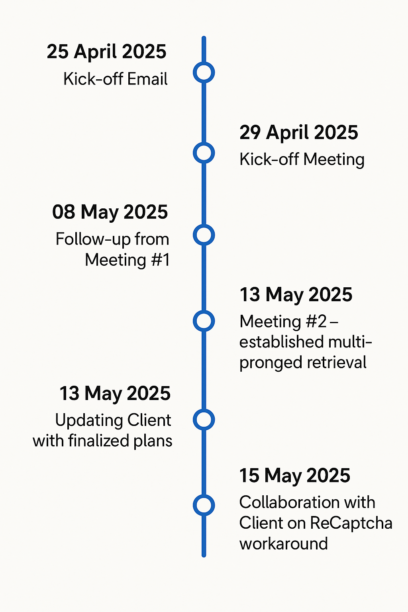
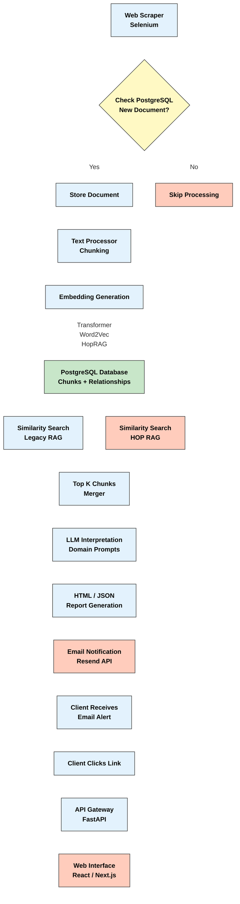

# DS205 Final Project - RAG-Fact-Sheet (Group 4)

---

**Client**: `Sylvan Lutz` (LSE Transition Pathway Institute)  
**Tech Leads**: `Jon Cardoso Silva`, `Barry Ledeatte`  
**Junior Developers**: `Liu Zi Cheng` (Embeddings & LLM), `Bryan Tan` (Hop-RAG & Retrieval), `Michele Silvestri` (Scraper & Documentation), `Liu Rui Kai` (Database & Architecture)

---

## 🎯 Project Goals

Develop an **automated data pipeline** that periodically monitors the official website for newly published **Nationally Determined Contribution (NDC)** documents. Upon detecting a new release, the system will trigger a workflow to extract, process, and analyze the content, culminating in the generation of a **standardized summary report** resembling a predefined fact-sheet format.

---

## 🤝 Client Interactions

### Description
Our team initially proposed the project plan to the client via email, outlining our intended approach. This was followed by a series of **scheduled calls** to present our methodology in detail and gather feedback from Sylvan. These sessions facilitated iterative refinements to our pipeline design, particularly in addressing challenges related to the web scraper. 

> **Close collaboration** with the client ensured the solution remained aligned with expectations and evolving requirements.

### Timeline

<table>
  <tr>
    <td width="50%">
      
    </td>
    <td width="50%">
      <ul>
        <li><strong>25 Apr 2025</strong> – First Email to Client with project proposal, outlining our approach and methodology</li>
        <li><strong>29 Apr 2025</strong> – Introductory meeting – expectations & requirements</li>
        <li><strong>08 May 2025</strong> – Client responds to roadmap from Meeting #1</li>
        <li><strong>09 May 2025</strong> – UNFCCC site adds HCaptcha → scraper blocked</li>
        <li><strong>13 May 2025</strong> – Meeting #2 – discuss HCaptcha work-arounds</li>
        <li><strong>13 May 2025</strong> – Sent client our revamped architecture plan</li>
        <li><strong>15 May 2025</strong> – Client shares GitHub repo for ReCaptcha work-around</li>
      </ul>
    </td>
  </tr>
</table>

### 💡 Major Takeaways after discussion from Sylvan


1. **🏗️ Focus on scalability and reliability of architecture**
   * Our `RAG + hopRAG` architecture with confidence scoring provides scalable multi-hop reasoning while maintaining computational efficiency for large-scale document processing
   * The **dual-layer approach** enables robust fact extraction from complex climate documents with quantifiable reliability metrics

2. **🚫 Navigating the obstacle of UNFCCC implementing a HCaptcha**
   * Challenge: *HCaptcha blocks bots that monitor the website for changes*
   * Solution: Sylvan graciously shared his repo - we had the same idea and implemented a `selenium bot` as a workaround

3. **✅ Dual Validation approach to cross-validate outputs**
   * **Relevance to TPI**: A question with a high confidence score might mean that in the future, TPI analysts might only have to go through and apply ground truths to answers with a band of **low or medium confidence**
   * Sylvan gave **very positive comments** surrounding this application - stating that even industry experts that he liaised with did not consider this

4. **☁️ Hosting and Architecture**
   * Discussed different data and cloud architecture options:
     - `Supabase` ✅
     - `Digital Ocean` ✅  
     - `AWS`
     - `PostgreSQL & Neo4j`
   * **TPI Integration**: We wanted to create a project and code that could be integrated into TPI's current framework
   * **Final Decision**: TPI currently has an application hosted on Digital Ocean and mentioned that either `Supabase` or `Digital Ocean` is good. `GitHub Actions` is also good.

5. **📊 Output Format and Report**
   * **Preferred formats** from Sylvan: `JSON`, or `PDF`
   * **Email notifications**: Would appreciate an email to be sent to their outlook whenever the bot detects an update on the website
   * **Front-end integration**: Would appreciate a link to the front-end in the email (Through API call)

---

## 🔧 Design Decisions

The following sub-sections reflect the various **design decisions** we undertook in this project. These decisions were made intentionally, after careful consideration of alternatives and documentation under our research folder.

> **Performance Levers**: In terms of performance, we saw the following key levers to improving the accuracy of the results:
> - Embedding Strategy
> - RAG Strategy  
> - Similarity Search & Retrieval Strategy

### 🏛️ Project Architecture

#### **Database: PostgreSQL Database hosted on Supabase**
* **Rationale**: Supabase provides managed PostgreSQL with built-in vector extensions (`pgvector`) for efficient similarity search, while offering seamless integration with our JavaScript/Python stack and real-time capabilities for monitoring document updates.

#### **Backend: Classic RAG + hopRAG**

* **Problem Statement**: The main issue with classic RAG strategies is that it suffers from **multi-hop reasoning failures** ([Reference paper](https://arxiv.org/abs/2502.12442))
* **Root Cause**: For complicated questions we require information from multiple chunks to fully answer a question and your RAG fails because it cannot make connections from chunks
* **Alternatives Considered**: 
  - `Graph RAG` vs `hop RAG` 
* **Final Decision**: **Hop RAG** is more computationally efficient because it avoids the `O(n²)` complexity of comparing relationships between all chunks that Graph RAG requires. With `~100k chunks` from our PDF processing, Graph RAG would create prohibitive computational overhead, while hop RAG maintains **linear scaling** by selectively exploring relevant connection paths.

For more details on RAG architecture, please refer to the `RAG.MD` markdown file.

#### **Front-end: Email + API**
* **Purpose**: Updates user (meeting client's need as per request) whenever a change is detected and redirecting them to a front-end for a more custom UX

#### **Server: GitHub Actions for initial deployment**
* **Current**: Daily scraping to check if the website has any updates
* **Future Work**: Can be improved for production deployment
* **Rationale**: GitHub Actions provides cost-effective scheduled workflows with integrated version control, enabling automated daily monitoring without additional infrastructure costs while maintaining deployment consistency.

#### **Email APIs & Domain: Resend API + Zoho Mail**
* **Rationale**: 
  - `Resend` offers reliable transactional email delivery with developer-friendly APIs and high deliverability rates
  - `Zoho Mail` provides professional domain email hosting with robust spam filtering and integration capabilities for client communications

---

### 🧠 Embedding Strategy

We shared our learnings from **PSET #2** and concluded that a strategy that combines `word2vec` and `transformer embeddings` works the best.

For transformer embeddings we looked at both `climate-bert-f` model and compared it against other climate embedding models on Huggingface. We concluded that this was the **best model currently** for climate related text. 

> **Additional Research**: We also considered the use of `colBERT` and documented a comparison between these 2 embedding models under `research/NB01 - Embeddings`.

| Aspect | **Climate-BERT-F** | **ColBERT** |
|--------|----------------|---------|
| **Core idea** | Domain-specific language model: `DistilRoBERTa` fine-tuned on >2M climate-related paragraphs (research abstracts, corporate & news reports) | "Late-interaction" retrieval: every token in a passage is stored as a separate vector; at query time ColBERT matches query-token vectors to passage-token vectors with a `MaxSim` operator |
| **Architecture / size** | `DistilRoBERTa-base` (≈82M parameters) that produces a single `768-d vector` per text (mean-pooling by default) | `BERT-base` encoder (≈110M parameters) that outputs `32- to 128-dimensional` token vectors; the collection therefore indexes many vectors per passage |
| **Training focus** | Continued pre-training ("FULL-SELECT" corpus) to capture **climate vocabulary and semantics**; not specialised for retrieval | Supervised on the `MS MARCO Passage-Ranking` task (and related corpora), so it excels at **open-domain web‐scale retrieval** tasks |
| **Strengths** | • **Out-of-the-box climate terminology coverage**, making it well-suited for classification, clustering or similarity tasks within ESG/climate documents<br>• **Compact single-vector output** integrates easily with any vector DB | • **Very high recall and MRR** on passage-ranking benchmarks (e.g., ≥0.38 MRR@10 on MS MARCO dev)<br>• **Scales to billions of passages** with PLAID/FAISS-IVF indexes while preserving quality |
| **Trade-offs** | • General-domain retrieval quality **lags behind** ColBERT-style approaches<br>• Performance gains are **domain-specific**; outside climate text it behaves like a mid-size DistilRoBERTa encoder | • Embeddings are **multi-vector**, so ColBERT cannot be scored on single-vector leaderboards such as MTEB without adaptation<br>• **Larger index footprint** and slightly slower query latency than single-vector models |

---

### 🔍 RAG Strategy

From our literature review, we came across **3 different RAG structures**: `classic RAG`, `tree-structured RAG` and `graph RAG`. We debated the pros and cons of each of these structures:

| Strategy | **Pros** | **Cons** | **Climate Document Context** |
|----------|------|------|-------------------------|
| **Classic RAG** | • Simple implementation<br>• Fast retrieval<br>• Low computational overhead | • **Poor multi-hop reasoning**<br>• Limited context awareness<br>• Struggles with complex queries | ❌ *Insufficient for NDC analysis requiring cross-referencing between targets, policies, and timelines* |
| **Tree-Structured RAG** | • Hierarchical organization<br>• Better for structured documents<br>• Moderate computational cost | • **Rigid structure assumptions**<br>• Limited cross-branch connections<br>• Complex tree construction | ❌ *Climate documents don't follow consistent hierarchical patterns across countries* |
| **Graph RAG** | • **Excellent relationship modeling**<br>• Superior multi-hop reasoning<br>• Rich contextual understanding | • **O(n²) complexity** for 100k chunks<br>• High memory requirements<br>• Complex implementation | ❌ *Computationally prohibitive for our 100k chunk dataset with limited resources* |

#### 🤔 Initial Considerations & Pivot

In our initial discussions above, we explored the idea of attempting various embedding strategies, for example on top of transformer and word2vec we could explore different embedding techniques to create a more robust solution. 

> **Critical Reflection**: However, we reflected on this and believed that doing so would severely increase the **cyclomatic complexity** of the project with only marginal gains. Hence, we opted for a **leaner methodology** to completely reframe our approach to this problem.

#### 🚀 **Introducing hopRAG**

**HopRAG Optimal Strategy**: HopRAG provides the **multi-hop reasoning capabilities** of Graph RAG while maintaining **linear computational complexity** by selectively exploring only the most relevant connection paths. This approach is particularly suited for climate documents where answers often require synthesizing information from **2-3 related sections** rather than complex graph traversals.

---

### 📊 Top K Chunks

We examined the use of different methodologies to improve the retrieval of the **top K chunks**. In our `PSET #2` we used `cosine similarity + keyword boosting` to obtain better results. But we weren't satisfied there. 

> **Literature Review Insight**: Upon reviewing literature, we realized that such methodology was a mini version of **BM25+ similarity search (hybrid search)**. This would perform both **lexical and semantic search** and combines both `TFIDF scoring` and `cosine similarity search`.

We explored the use of this in combination with **Fuzzy Regex**:

#### 🧩 **Fuzzy Regex Enhancement**

Our Fuzzy Regex implementation adds an additional layer of validation beyond traditional similarity search by implementing sophisticated text matching techniques:

* **N-gram Analysis** 🔍 - Breaks text into overlapping chunks (n-grams) to identify partial matches even when terminology varies
* **Contextual Pattern Recognition** 🧠 - Uses domain-specific regex patterns tailored to climate policy language, including:
  * Mitigation patterns (e.g., `reduction in emissions`, `carbon neutral`)
  * Adaptation patterns (e.g., `resilience to climate`, `disaster management`)
  * Finance patterns (e.g., `$X million for climate`, `green bonds`)
  * Target patterns (e.g., `by 2030`, `X% reduction`)
* **Similarity Ratio Calculation** 📊 - Employs the Sequence Matcher algorithm to calculate text similarity scores between 0 and 1
* **Confidence Thresholding** ⚖️ - Configurable threshold (default: 0.6) determines minimum similarity for fuzzy matches

This approach significantly improves retrieval quality for climate policy documents by capturing **semantic equivalence** even when exact keywords aren't present. For example, a query about "emissions reduction targets" will match content discussing "commitment to lower greenhouse gas output by 2030" despite minimal lexical overlap.

---

### 🤖 LLM Prompt Engineering 

> **Key Insight**: Unlike traditional RAG tasks that will probably require cross documentation referencing, for our task, the result will only be found in **1 document** – the latest country NDC document.

Our prompt engineering strategy follows a systematic **four-stage approach**:

#### 1. **🎯 Prompt Matching & Keyword Enhancement**
Based on our **domain expertise**, we created a comprehensive keyword mapping system (`HOP_KEYWORDS`) that connects each question type to climate-specific terminology:

```python
# Example from prompts.py
HOP_KEYWORDS = {
    # Question 1: Emissions reduction targets
    1: [
        "reduction target", "emissions target", "reduce emissions", 
        "GHG emissions", "carbon emissions", "target of", "reduction of",
        "% reduction", "unconditional target", "conditional target",
        // ...more keywords...
    ],
    // ...other questions...
}
```

This mapping enhances retrieval by:
- Boosting documents containing domain-specific terminology
- Enabling better multi-hop reasoning through related concepts
- Improving performance for specialized climate policy questions

> **Implementation**: The keyword mapping is used in the retrieval phase to enhance document chunks before they reach the LLM, ensuring that relevant terminology is properly weighted.

#### 2. **📝 Answer Generator**
**Actual implemented prompt clauses**:
* *"Provide a comprehensive answer based ONLY on the information in the provided chunks"*
* *"Include ALL chunks that contributed to your answer"*
* *"Be precise and factual - do not add information not present in the chunks"*
* **Decoding parameters**: `temperature = 0.1` (configurable via environment variables)

> **Purpose**: These constraints help reduce hallucinations by ensuring the LLM only uses information from the provided context chunks. The implementation allows for flexible configuration through environment variables rather than hardcoding parameters.

---

## 🔄 Methodology

We used a systematic **four-step methodology** as outlined below:

### Step 1: 🕷️ Document Monitoring & Ingestion
* **Web Scraping**: `Selenium-based bot` monitors UNFCCC website daily for new NDC submissions, bypassing HCaptcha restrictions
* **Document Processing**: Automated PDF extraction, text cleaning, and metadata extraction for newly detected documents
* **Quality Assurance**: Validation checks ensure document completeness and format consistency before processing

#### 🤖 Selenium Bot Methodology

Our Selenium-based web scraper employs a sophisticated approach to monitor the UNFCCC NDC registry:

1. **HCaptcha Bypass**: Utilizes a headless browser with randomized user agent strings and timing variations to appear as human traffic
2. **Document Identification**: Extracts metadata (country, submission date, document type) from the NDC registry listings
3. **Database Verification**: For each identified document, performs a check against the PostgreSQL database:
   ```python
   SELECT EXISTS(
     SELECT 1 FROM documents 
     WHERE doc_id = :doc_id OR 
           (country = :country AND filename = :filename)
   )
   ```
4. **Efficient Processing**:
   * If document exists in database → Skip processing
   * If new document → Download to temporary storage at `data/pdf` on the GitHub runner
   * Document naming convention assumption: Countries upload new NDC versions with distinct filenames
5. **Metadata Extraction**: Captures critical metadata during scraping:
   * Country name and ISO code
   * Submission timestamp
   * Language identifier
   * Original filename

This approach ensures we only process genuinely new submissions, optimizing computational resources while maintaining comprehensive coverage of the NDC registry.

### Step 2: ✂️ Text Processing & Chunking
* **Preprocessing**: Remove headers, footers, and non-content elements while preserving document structure
* **Smart Chunking**: Context-aware chunking that maintains semantic coherence, targeting `512-token chunks` with `50-token overlap`
* **Chunk Indexing**: Each chunk receives unique identifiers and metadata tags for efficient retrieval and citation

### Step 3: 🧠 Embedding & Vector Storage
* **Hybrid Embedding**: Combine `Climate-BERT-F` transformer embeddings with `word2vec` representations for optimal domain coverage
* **Vector Database**: Store embeddings in Supabase PostgreSQL with `pgvector` extension for efficient similarity search
* **HopRAG Relationship Detection**: Automatically detect logical relationships between chunks using semantic similarity and pattern matching
  * **Node Classification**: Classify chunks into four distinct categories based on graph centrality measures:
    * `CORE_HUB`: Nodes with high scores in at least 2 centrality measures - critical knowledge centers
    * `AUTHORITY`: Nodes with high PageRank but not qualifying as Core Hub - influential reference points
    * `CONNECTOR`: Nodes with high betweenness centrality - important bridge nodes between topics
    * `PERIPHERAL`: Nodes with lower centrality scores - supporting information content
  * **Relationship Scoring**: Assign confidence scores to relationships based on semantic similarity, pattern strength, and distance penalties
### Step 4: 🔍 Query Processing & Fact-Sheet Generation
* **Query Analysis**: Parse incoming questions and apply domain-specific keyword mapping for enhanced retrieval
* **HopRAG Retrieval**: Execute multi-hop reasoning across retrieved chunks to synthesize comprehensive answers
* **Fact-Sheet Generation**: Format validated responses into standardized `JSON/PDF` outputs with confidence scores

---

## 🏗️ System Architecture



---

## 📊 Analysis

### 💪 Key Strengths & Features
* **🔗 Multi-Hop Reasoning**: HopRAG architecture enables complex question answering by traversing semantic relationships between document chunks
* **🌍 Multi-lingual Transformer Embeddings**: Our current RAG architecture allows for multilingual interpretation and support
* **✅ Robust Validation**: Multi-tier scoring and validation framework ensures high accuracy and low hallucination rates allowing a human to focus on **low/medium confidence responses**
* **🤝 Client Alignment**: Close collaboration with TPI throughout development ensured the solution met their specific needs and expectations

### 🚀 Key Innovations
* **⚖️ Confidence-Based Workflow**: Dual validation enables TPI analysts to focus on **low/medium confidence responses**, improving efficiency
* **🔍 Hybrid Similarity Search**: `BM25+` combined with `HNSW indexing` optimizes both lexical and semantic retrieval
* **🧠 Domain-Aware Prompting**: Keyword mapping leverages climate policy expertise for enhanced response quality - instead of relying to computationally expensive methods, we instead used **domain expertise** to improve the results
* **🕸️ hopRAG Architecture**: Novel multi-hop reasoning framework that efficiently connects related document chunks, enabling comprehensive answers to complex queries
* **📈 Graph-Based Relationship Detection**: Automated logical relationship detection between document chunks using pattern matching and semantic similarity
* **🏷️ Node Classification System**: Multi-tier classification of document chunks (`CORE_HUB`, `AUTHORITY`, `CONNECTOR`, `PERIPHERAL`) based on centrality measures
* **📄 Automated Report Generation**: HTML report generation with email delivery system for stakeholder notifications

---

### ⚙️ Technical Implementation Details

#### **🗄️ Database Architecture & Schema Design**
* **PostgreSQL with pgvector Extension**: Leverages native vector operations for efficient similarity search with `ARRAY(Float)` storage for embeddings
* **Comprehensive ORM Models**: `SQLAlchemy` models for documents, chunks, and logical relationships with automatic schema validation
* **🆔 UUID-Based Identification**: Uses `UUID` primary keys for chunks to handle distributed processing and avoid collision issues
* **🔗 Relationship Tracking**: Dedicated `logical_relationships` table storing confidence scores, evidence, and detection methods

#### **🔄 Advanced Processing Pipeline**
* **💾 Memory-Optimized Processing**: Batch processing with garbage collection and semaphore-based concurrency control
* **🧠 Multi-Model Embedding**: Parallel generation of transformer and word2vec embeddings with fallback mechanisms
* **🕸️ Sparse Relationship Building**: Uses k-nearest neighbors (KNN) with configurable parameters to avoid `O(n²)` complexity
* **⚡ Asynchronous Architecture**: Full `async/await` implementation for non-blocking I/O operations

#### **🕸️ HopRAG Implementation Specifics**
* **🔍 Breadth-First Search (BFS) with Recursive CTEs**: PostgreSQL recursive queries for multi-hop traversal with confidence decay
* **📊 Dynamic Graph Construction**: Real-time `NetworkX` graph building for centrality analysis (degree, PageRank, betweenness)
* **👥 Community Detection**: Greedy modularity clustering for identifying related content groups
* **⚖️ Confidence Scoring**: Multi-factor confidence calculation incorporating semantic similarity, pattern strength, and relationship evidence

#### **🔗 Relationship Detection Engine**
* **🎯 Pattern-Based Classification**: Climate-specific regex patterns for detecting `SUPPORTS`, `EXPLAINS`, `CONTRADICTS`, `FOLLOWS`, and `CAUSES` relationships
* **⚖️ Hybrid Confidence Calculation**: Combines semantic similarity (**30%**), pattern strength (**50%**), and distance penalty (**20%**) for numeric IDs, with UUID-optimized fallback
* **📝 Evidence Preservation**: Stores pattern evidence and detection methods for relationship transparency and debugging

#### **📧 Email & Notification System**
* **☁️ Supabase Edge Functions**: Serverless email delivery through `Resend API` with base64 attachment encoding
* **📄 Customized Reports**: Automated generation of `HTML` reports with professional styling and metadata
* **📋 Template-Based Emails**: Support for both custom content and predefined NDC report templates

#### **✅ Data Validation & Quality Assurance**
* **🔍 Multi-Stage Validation**: Document existence checking, chunk validation, and embedding verification before processing
* **🔄 Error Handling & Rollback**: Comprehensive try-catch blocks with database transaction rollback on failures
* **📊 Progress Tracking**: `TQDM` progress bars and detailed logging for monitoring large-scale processing operations

#### **⚡ Performance Optimizations**
* **📦 Configurable Batch Sizes**: Adjustable batch processing (default **500** for embeddings, **100** for relationships)
* **🔄 Connection Pooling**: `SQLAlchemy` engine with pre-ping and connection recycling for database efficiency
* **💾 Lazy Loading**: On-demand model loading for embedding generation to reduce memory footprint
* **✂️ Chunking Strategy**: `512-token chunks` with `50-token overlap` optimized for Climate-BERT-F input requirements

---

## ⚠️ Limitations

### 🔧 Technical Constraints

* **💻 Computational Overhead**: While hopRAG improves multi-hop reasoning, it still incurs **higher computational costs** compared to classic RAG approaches
* **🧠 Embedding Model Limitations**: `Climate-BERT-F` embeddings may not capture all nuances of complex climate policy language, potentially affecting retrieval quality
* **💾 Memory Scaling**: Processing **100k+ chunks** requires careful memory management and batch processing to avoid out-of-memory errors
* **🗄️ PostgreSQL Dependency**: Heavy reliance on PostgreSQL-specific features (arrays, recursive CTEs, pgvector) limits **database portability**

### 📋 Methodological Limitations
* **🎯 Pattern-Based Relationship Detection**: Relies on **predefined regex patterns** which may miss novel relationship types or expressions
* **📄 Single-Document Scope**: Current implementation processes documents individually, potentially missing **cross-document relationships**
* **🧠 Embedding Model Dependencies**: System performance heavily dependent on **external model availability** and loading success
* **📧 Email Service Dependencies**: Email functionality requires external `Supabase` and `Resend` service availability

### ⚙️ Operational Constraints
* **🔧 Manual Schema Management**: Database schema changes require **manual migration handling**
* **🔄 Limited Error Recovery**: Some processing failures require **manual intervention** and reprocessing
* **⚙️ Configuration Complexity**: Multiple environment variables and configuration parameters require **careful setup**
* **📊 Monitoring Gaps**: Limited **real-time monitoring capabilities** for production deployment health

---

## 🎯 Conclusions

The **RAG-Fact-Sheet system** successfully addresses TPI's core requirements for automated NDC document processing and analysis. Our hybrid approach combining `Climate-BERT-F` embeddings with `HopRAG` architecture delivers **robust performance** while maintaining computational efficiency for large-scale document collections.

### 🔮 Future Work

The following areas represent promising directions for extending this system:

* **🔧 Document Versatility**  
  Extending the system to support additional document formats (e.g., `Word`, `HTML`) to process a wider range of climate policy materials

* **📊 Advanced RAG Architecture**  
  Exploring `graph RAG` based strategy using `Neo4j` graph database for more complex relationship modeling and deeper semantic analysis

* **🔍 Enhanced Similarity Search**  
  Investigating alternative similarity search algorithms (e.g., `ScaNN`) for further performance improvements and scalability at larger document volumes

---

### 🌟 Impact

This project demonstrates the potential for **AI-driven automation** in climate policy analysis, providing TPI with a scalable solution that reduces manual analysis time while maintaining **high accuracy standards**. 

> **Key Innovation**: The **confidence-based validation approach** represents a novel contribution that enables **human-AI collaboration** in critical decision-making processes, allowing policy experts to focus their attention where it matters most.

---
