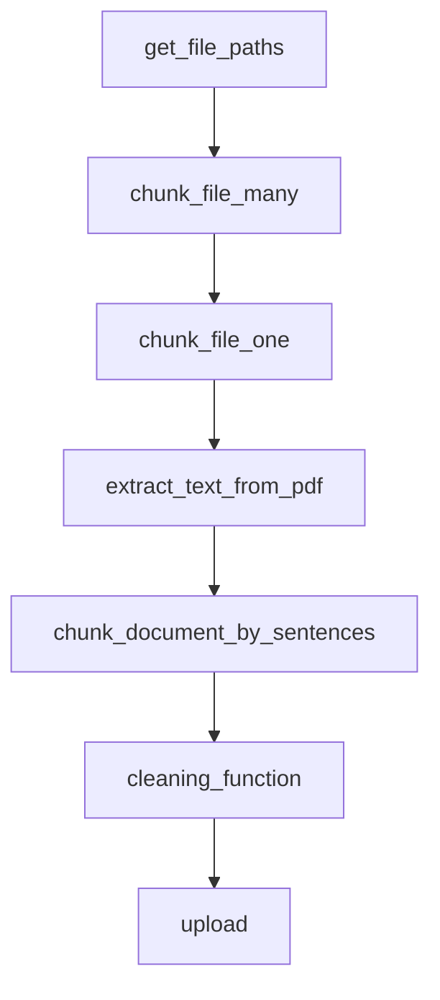
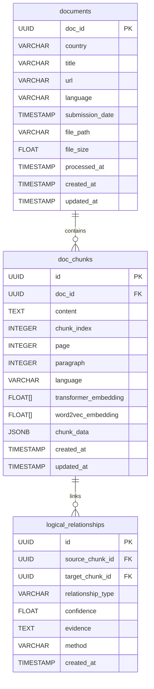

# Document Chunking Module Documentation

## Table of Contents

- [Overview](#overview)
- [System Architecture](#system-architecture)
- [Core Functions](#core-functions)
  - [Entry Point: run_script()](#entry-point-run_script)
  - [Individual Processing: chunk_file_one()](#individual-processing-chunk_file_one)
  - [Concurrent Processing: chunk_file_many()](#concurrent-processing-chunk_file_many)
  - [File Discovery: get_file_paths()](#file-discovery-get_file_paths)
- [Processing Pipeline](#processing-pipeline)
  - [Text Extraction](#text-extraction)
  - [Document Chunking](#document-chunking)
  - [Content Cleaning](#content-cleaning)
  - [Database Storage](#database-storage)
- [Error Handling & Resilience](#error-handling--resilience)
- [Database Schema](#database-schema)
- [Performance Considerations](#performance-considerations)
- [Usage Examples](#usage-examples)
- [Configuration](#configuration)

---

## Overview

The `2_chunk.py` module is a core component of the RAG (Retrieval-Augmented Generation) pipeline responsible for transforming raw PDF documents into structured, semantically coherent text chunks. This module processes NDC (Nationally Determined Contributions) documents and prepares them for vector embedding.

**Key Responsibilities:**
- Extract text from PDF documents using multiple fallback strategies
- Segment documents into semantically meaningful chunks
- Clean and standardize text content
- Store processed chunks in PostgreSQL database
- Handle document metadata and processing state

**Entry Point:**
```bash
python 2_chunk.py [--force]
```

**System Flow:**
```text
PDF Files (data/pdfs/)
    ↓
extract_text_from_pdf() [multiple strategies]
    ↓
DocChunker.chunk_document_by_sentences()
    ↓
DocChunker.cleaning_function()
    ↓
Database Storage (doc_chunks table)
```

---

## System Architecture

The module follows a pipeline architecture with clear separation of concerns:

```text
┌─────────────────┐    ┌─────────────────┐    ┌─────────────────┐
│  File Discovery │ -> │  Text Extraction│ -> │   Chunking      │
│  get_file_paths │    │  extractor.py   │    │  chunker.py     │
└─────────────────┘    └─────────────────┘    └─────────────────┘
                                                      │
┌─────────────────┐    ┌─────────────────┐    ┌─────────────────┐
│ Database Storage│ <- │  Text Cleaning  │ <- │  Validation     │
│  operations.py  │    │   cleaner.py    │    │    & QA         │
└─────────────────┘    └─────────────────┘    └─────────────────┘
```

**Key Components:**
- **extractor.py**: Multi-strategy PDF text extraction
- **chunker.py**: Sentence-based document segmentation  
- **cleaner.py**: Text cleaning and quality control
- **operations.py**: Database interaction layer
- **models.py**: SQLAlchemy ORM definitions

---

## Core Functions



### Entry Point: run_script()

**Function Signature:**
```python
@Logger.log(log_file=project_root / "logs/chunk.log", log_level="INFO")
async def run_script(force_reprocess: bool = False) -> None
```

**Purpose:** Main orchestrator function that processes all PDF files in the data directory.

**Process Flow:**
1. Discovers all PDF files using `get_file_paths()`
2. Creates async tasks for parallel processing
3. Shows progress bar for user feedback
4. Handles errors gracefully and logs results

### Individual Processing: chunk_file_one()

**Function Signature:**
```python
async def chunk_file_one(file_path: str, force_reprocess: bool = False) -> Optional[List[DocChunkORM]]
```

**Purpose:** Process a single PDF file through the complete chunking pipeline.

**Detailed Process:**

1. **Document State Check:**
   ```python
   doc_id = Path(file_path).stem
   is_processed, document = check_document_processed(session, doc_id)
   ```

2. **Document Creation (if needed):**
   - Extracts metadata from filename (country, language, date)
   - Creates `NDCDocumentORM` record
   - Uses deterministic UUID5 for consistent document IDs

3. **Multi-Strategy Text Extraction:**
   ```python
   extraction_strategies = ['fast', 'auto', 'ocr_only']
   for strategy in extraction_strategies:
       extracted_elements = extract_text_from_pdf(file_path, strategy=strategy)
   ```

4. **Document Chunking:**
   ```python
   chunks = DocChunker.chunk_document_by_sentences(extracted_elements)
   ```

5. **Content Cleaning:**
   ```python
   cleaned_chunks = DocChunker.cleaning_function(chunks)
   ```

6. **Database Storage:**
   - Creates `DocChunkORM` objects (without embeddings)
   - Uploads chunks to database
   - Updates document processing status

### Concurrent Processing: chunk_file_many()

**Function Signature:**
```python
async def chunk_file_many(file_path: str) -> Optional[List[DocChunkORM]]
```

**Purpose:** Wrapper function that adds concurrency control to individual file processing.

**Implementation:**
```python
semaphore = asyncio.Semaphore(FILE_PROCESSING_CONCURRENCY)
async with semaphore:
    return await chunk_file_one(file_path)
```

### File Discovery: get_file_paths()

**Function Signature:**
```python
def get_file_paths() -> List[str]
```

**Purpose:** Discovers all PDF files in the designated data directory.

**Process:**
1. Scans `data/pdfs/` directory
2. Filters for PDF files only
3. Converts Path objects to strings
4. Logs discovery results

---

## Processing Pipeline


### Text Extraction

The text extraction component (`extractor.py`) implements a robust multi-strategy approach:

**Strategy Hierarchy:**
1. **Fast**: Standard PDF text extraction without OCR
2. **Auto**: Automatic best-method detection
3. **OCR Only**: Optical Character Recognition for image-based PDFs

**Example Output:**
```python
{
    'text': "Climate change adaptation strategies...",
    'metadata': {
        'page_number': 1,
        'paragraph_number': 3,
        'country': 'Argentina',
        'element_type': 'Text',
        'extraction_strategy': 'fast'
    }
}
```

### Document Chunking

The chunking component (`chunker.py`) implements sentence-based segmentation:

**Configuration:**
- **Max Chunk Size**: 512 characters (configurable)
- **Overlap**: 2 sentences between chunks (configurable)
- **Special Handling**: Titles and headers as standalone chunks

**Algorithm:**
```python
def chunk_document_by_sentences(elements: list, max_chunk_size: int = 512, overlap: int = 2):
    # 1. Process each document element
    # 2. Handle titles/headers separately
    # 3. Split regular text into sentences
    # 4. Accumulate sentences until size threshold
    # 5. Create overlapping chunks for context preservation
```

**Metadata Preservation:**
- Page numbers
- Paragraph numbers
- Element types
- Document-level metadata (country, title, date)

### Content Cleaning

The cleaning component (`cleaner.py`) provides multi-stage text processing:

**Cleaning Strategies:**
1. **merge_short_chunks()**: Combines chunks below minimum length threshold
2. **split_long_chunks()**: Divides chunks exceeding maximum length
3. **remove_gibberish()**: Removes OCR artifacts and corrupted text

**Quality Filters:**
- Character corruption detection
- Common PDF artifact removal
- Minimum content length enforcement
- Excessive punctuation normalization

### Database Storage

The storage component uses SQLAlchemy ORM with PostgreSQL:

**Data Models:**
- **NDCDocumentORM**: Document metadata and processing state
- **DocChunkORM**: Individual text chunks with embeddings (filled later)
- **LogicalRelationshipORM**: Inter-chunk relationships

**Storage Process:**
1. Create document record if not exists
2. Generate UUID4 for each chunk
3. Store chunk content and metadata
4. Update document processing timestamp
5. Handle transaction rollback on errors

---

## Error Handling & Resilience

The module implements comprehensive error handling:

**Extraction Fallbacks:**
```python
# Multi-strategy extraction with fallbacks
for strategy in ['fast', 'auto', 'ocr_only']:
    try:
        extracted_elements = extract_text_from_pdf(file_path, strategy=strategy)
        if extracted_elements and len(extracted_elements) > 0:
            break
    except Exception as e:
        logger.warning(f"Strategy {strategy} failed: {e}")
```

**Database Transaction Safety:**
```python
try:
    session.add(chunk_model)
    session.commit()
except Exception as e:
    session.rollback()
    logger.error(f"Database error: {e}")
finally:
    session.close()
```

**Graceful Degradation:**
- Fallback content creation when extraction fails
- Continued processing when individual files fail
- Progress tracking even with errors

---

## Database Schema



**Key Relationships:**
- Documents contain multiple chunks (CASCADE DELETE)
- Chunks can have logical relationships with other chunks
- Embeddings are populated later by the embedding module

---

## Performance Considerations

**Concurrency Control:**
- Configurable processing concurrency via `FILE_PROCESSING_CONCURRENCY`
- Async/await pattern for non-blocking I/O operations
- Semaphore-based resource management

**Memory Management:**
- Streaming text processing to avoid loading entire documents
- Immediate database commits to free memory
- Connection pooling via SQLAlchemy

**Processing Optimization:**
- Early termination of extraction strategies on success
- Chunk validation before database operations
- Efficient metadata copying and merging

---

## Usage Examples

### Basic Processing
```bash
# Process all PDF files
python 2_chunk.py

# Force reprocess all files (for debugging)
python 2_chunk.py --force
```

### Programmatic Usage
```python
import asyncio
from entrypoints.chunk import run_script

# Process all files
asyncio.run(run_script(force_reprocess=False))

# Process single file
from entrypoints.chunk import chunk_file_one
chunks = await chunk_file_one("path/to/document.pdf")
```

### Custom Configuration
```python
# Configure chunk sizes
chunks = DocChunker.chunk_document_by_sentences(
    elements=extracted_elements,
    max_chunk_size=1024,  # Larger chunks
    overlap=3             # More overlap for context
)
```

---

## Configuration

**Environment Variables:**
- `FILE_PROCESSING_CONCURRENCY`: Maximum concurrent file processing

**File Paths:**
- Input: `data/pdfs/`
- Logs: `logs/chunk.log`
- Processed data: Database storage

**Key Parameters:**
- Default chunk size: 512 characters
- Default overlap: 2 sentences
- Minimum chunk length: 20 characters
- Maximum chunk length: 1000 characters

**Database Connection:**
- Uses `PostgresConnection()` from `databases.auth`
- Automatic session management and cleanup
- Transaction safety with rollback support

---

## Dependencies

**Core Libraries:**
- `unstructured`: PDF text extraction
- `nltk`: Sentence tokenization
- `sqlalchemy`: Database ORM
- `asyncio`: Asynchronous processing
- `tqdm`: Progress tracking

**Internal Modules:**
- `group4py.src.chunk.extractor`
- `group4py.src.chunk.chunker`  
- `group4py.src.chunk.cleaner`
- `databases.models`
- `databases.operations`
- `databases.auth`

The module is designed for reliability, scalability, and maintainability, serving as a critical foundation for the downstream embedding and retrieval components of the RAG pipeline. 
