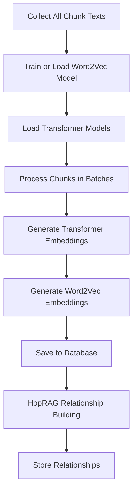
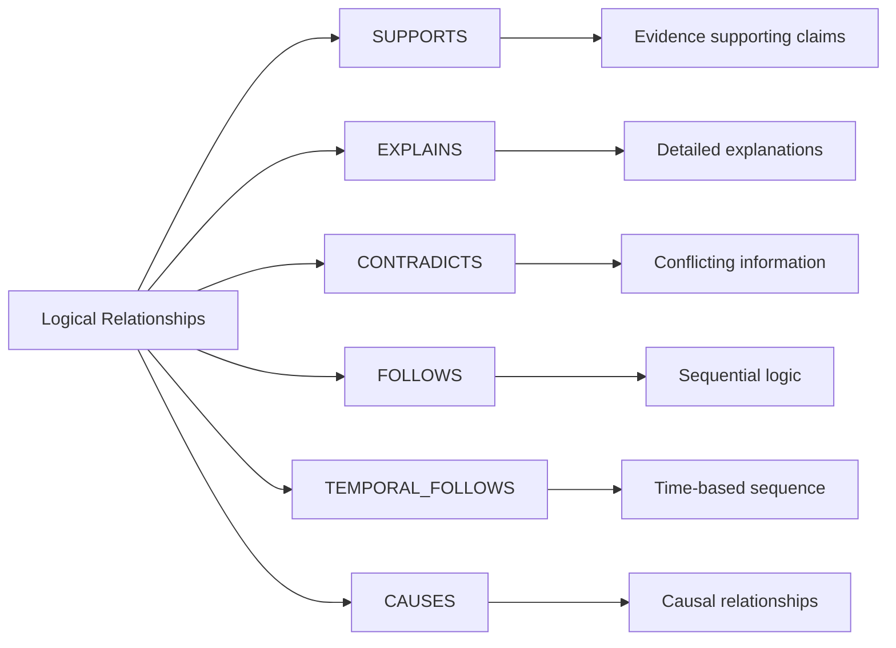
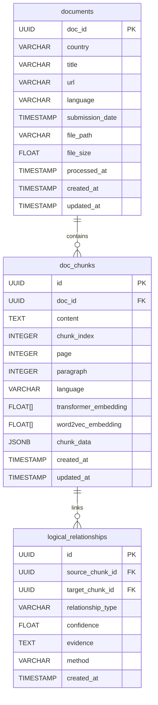

# Vector Embedding Module Documentation

## Overview

The embedding module transforms processed document chunks into high-dimensional vector representations that enable semantic search and relationship discovery. This system combines multiple embedding strategies with graph-based relationship modeling to create a rich knowledge representation for the RAG pipeline.

**Core Purpose:** Convert text chunks into numerical vectors while building logical relationships between related content pieces.

**Entry Point:**
```bash
python 3_embed.py [--force]
```

## Table of Contents

- [System Architecture](#system-architecture)
- [Embedding Strategies](#embedding-strategies)
- [Processing Workflow](#processing-workflow)
- [Relationship Discovery](#relationship-discovery)
- [Database Integration](#database-integration)
- [Performance & Optimization](#performance--optimization)
- [Usage Examples](#usage-examples)
- [Configuration](#configuration)

---

## System Architecture

The embedding system uses a three-layer approach to maximize semantic understanding:

```text
┌─────────────────────────────────────────────────────┐
│                Raw Text Chunks                      │
│            (from chunking module)                   │
└─────────────────┬───────────────────────────────────┘
                  │
        ┌─────────▼─────────┐
        │  Global Word2Vec  │
        │     Training      │
        └─────────┬─────────┘
                  │
    ┌─────────────▼─────────────┐
    │    Combined Embedding     │
    │  • Transformer (BERT)     │
    │  • Word2Vec (Global)      │
    └─────────────┬─────────────┘
                  │
        ┌─────────▼─────────┐
        │   HopRAG Graph    │
        │   Relationships   │
        └───────────────────┘
```

**Design Rationale:**
- **Transformer embeddings** capture deep contextual meaning
- **Word2Vec embeddings** provide document-specific semantic relationships
- **Graph relationships** enable multi-hop reasoning and knowledge discovery

---

## Embedding Strategies

### 1. Transformer Embeddings

**Models Used:**
- **English**: DistilRoBERTa-base (faster, smaller)
- **Multilingual**: sentence-transformers/paraphrase-multilingual-MiniLM-L12-v2

**Language Detection Logic:**
```python
def _determine_language(filename, metadata):
    # 1. Check metadata first
    # 2. Extract from filename patterns (e.g., "doc_fr.pdf")
    # 3. Match country to language via COUNTRY_LANG_MAP
    # 4. Default to English
```

English documents get optimized processing with the specialized model, while multilingual content uses the broader model for balanced accuracy and efficiency.

### 2. Word2Vec Embeddings

**Global Training Strategy:**
The system trains a single Word2Vec model on ALL document content, then uses this global model to embed individual chunks. This ensures consistent vocabulary across all documents and better handling of domain-specific terminology.

**Configuration:**
```python
Word2Vec(
    vector_size=300,      # Standard dimensionality
    window=10,           # Larger context window for policy docs
    min_count=2,         # Include rare climate terms
    sg=1,               # Skip-gram for better rare word handling
    epochs=10           # Sufficient training for domain vocabulary
)
```

### 3. HopRAG Graph Embeddings

**Purpose:** Create specialized embeddings optimized for relationship detection and graph-based retrieval.

**Model:** `all-MiniLM-L6-v2` (lightweight, fast, good for similarity calculations)

**Processing:**
- Batch processing for memory efficiency
- Memory optimization with garbage collection
- Fallback handling for failed embeddings

---

## Processing Workflow



### Main Processing Function: `embed_all_chunks()`

**Step 1: Global Vocabulary Building**
```python
chunk_texts = collect_all_chunk_texts(session)
# Collects ALL chunk content for comprehensive vocabulary
```

**Step 2: Word2Vec Model Training**
```python
if model_path.exists() and not force_reembed:
    # Load existing model
else:
    # Train new global model on all texts
    embedding_model.train_word2vec_on_texts(chunk_texts, model_path)
```

**Step 3: Individual Chunk Processing**
```python
for chunk in chunks_query:
    # Generate transformer embedding (context-aware)
    transformer_embedding = embedding_model.transformer_embedder.embed_transformer(chunk.content)
    
    # Generate Word2Vec embedding (using global model)
    word2vec_embedding = embedding_model.word2vec_embedder.embed_text(chunk.content)
    
    # Store both embeddings in database
    chunk.transformer_embedding = transformer_embedding
    chunk.word2vec_embedding = word2vec_embedding
```

**Step 4: Relationship Discovery**
```python
# HopRAG processing for logical relationships
processor = HopRAGGraphProcessor()
await processor.process_embeddings_batch(batch_size=100)
await processor.build_relationships_sparse(max_neighbors=30, min_confidence=0.55)
```

### Error Handling & Resilience

**Multi-Level Fallbacks:**
- If transformer embedding fails → continue with Word2Vec only
- If Word2Vec fails → continue with transformer only
- If HopRAG fails → embeddings are still valid, just no relationships
- Periodic commits prevent data loss on large batches

**Memory Management:**
```python
# Commit every 500 chunks to avoid memory issues
if processed_count % 500 == 0:
    session.commit()
```

---

## Relationship Discovery

### HopRAG Relationship Types



### Detection Algorithm

**Pattern-Based Detection:**
```python
# Example patterns for SUPPORTS relationship
patterns = [
    (r"evidence shows", r"(therefore|thus|consequently)"),
    (r"studies indicate", r"(supporting|confirming)"),
    (r"data reveals", r"(demonstrates|proves)")
]
```

**Confidence Scoring:**
```python
confidence = (
    0.3 * semantic_similarity +    # How similar are the embeddings?
    0.5 * pattern_strength +       # How strong is the pattern match?
    0.2 * distance_penalty         # How close are the chunks?
)
```

Climate policy documents have specific linguistic patterns that pure semantic similarity might miss. Combining pattern matching with embeddings catches both explicit logical indicators and implicit semantic relationships.

---

## Database Integration

### Storage Schema



### UUID Consistency

**Deterministic Document IDs:**
```python
doc_uuid = uuid.uuid5(uuid.NAMESPACE_DNS, doc_id)
# Same document always gets same UUID across runs
```

**Random Chunk IDs:**
```python
chunk_id = uuid.uuid4()
# Each chunk gets unique ID, but references are maintained
```

---

## Performance & Optimization

### Concurrency & Memory

**Batch Processing:**
- Embeddings processed in configurable batches (default: 500 chunks)
- Periodic database commits prevent memory overflow
- Thread pool executor for CPU-intensive operations

**Memory Optimization:**
```python
# HopRAG batch processing with garbage collection
for i in range(0, len(texts), self.batch_size):
    batch_embeddings = self.model.encode(batch)
    if i % (self.batch_size * 10) == 0:
        gc.collect()  # Prevent memory accumulation
```

**Database Optimization:**
- Indexes on chunk embeddings for fast similarity search
- Cascading deletes maintain referential integrity
- Connection pooling via SQLAlchemy

### Model Loading Strategy

**Lazy Loading:**
```python
def load_models(self):
    if not self.models_loaded:
        # Load only when needed
        self.english_model = load_english_model()
        self.multilingual_model = load_multilingual_model()
```

**Model Persistence:**
```python
# Word2Vec model saved/loaded to avoid retraining
model_path = project_root / "local_models" / "word2vec"
```

---

## Usage Examples

### Basic Embedding Generation

```bash
# Process all chunks without embeddings
python 3_embed.py

# Force regenerate all embeddings (for model updates)
python 3_embed.py --force
```

### Programmatic Usage

```python
# Custom embedding generation
from embed.combined import CombinedEmbedding

embedding_model = CombinedEmbedding()
embedding_model.load_models()

# Single text embedding
transformer_emb = embedding_model.transformer_embedder.embed_transformer("Climate adaptation strategies...")
word2vec_emb = embedding_model.word2vec_embedder.embed_text("Climate adaptation strategies...")
```

### HopRAG Relationship Discovery

```python
# Standalone relationship processing
from embed.hoprag import HopRAGGraphProcessor

processor = HopRAGGraphProcessor()
await processor.process_embeddings_batch(batch_size=100)
await processor.build_relationships_sparse(
    max_neighbors=30,
    min_confidence=0.55
)
```

---

## Configuration

### Environment Variables
- Standard database connection variables
- Model cache directories
- Processing batch sizes

### Key Parameters

**Word2Vec Training:**
- `vector_size`: 300 (standard for climate domain)
- `window`: 10 (captures policy document context)
- `min_count`: 2 (includes rare climate terms)

**Relationship Detection:**
- `max_neighbors`: 30 (balance between coverage and noise)
- `min_confidence`: 0.55 (filters weak relationships)
- `batch_size`: 100 (memory-performance balance)

**Model Paths:**
- Transformer models: Downloaded to `~/.cache/huggingface/`
- Word2Vec model: `local_models/word2vec/`
- Logs: `logs/embed.log`

### Performance Tuning

**For Large Document Sets:**
```python
# Increase batch size for better throughput
await processor.process_embeddings_batch(batch_size=200)

# Reduce relationship parameters for faster processing
await processor.build_relationships_sparse(
    max_neighbors=20,
    min_confidence=0.65
)
```

**For Memory-Constrained Systems:**
```python
# Reduce batch sizes
embedding_model = CombinedEmbedding()
embedding_model.word2vec_embedder.batch_size = 250
```

---

## Dependencies

**Core Libraries:**
- `transformers`: BERT/RoBERTa models
- `sentence-transformers`: Specialized embedding models
- `gensim`: Word2Vec implementation
- `torch`: Neural network backend
- `sklearn`: Similarity calculations and clustering
- `networkx`: Graph analysis

**Internal Modules:**
- `embed.combined`: Orchestrates multiple embedding strategies
- `embed.transformer`: Handles BERT-style models
- `embed.word2vec`: Global Word2Vec training and embedding
- `embed.hoprag`: Graph-based relationship discovery

This embedding system provides a robust foundation for semantic search and knowledge discovery, balancing accuracy with processing efficiency while maintaining data consistency across the entire pipeline. 
