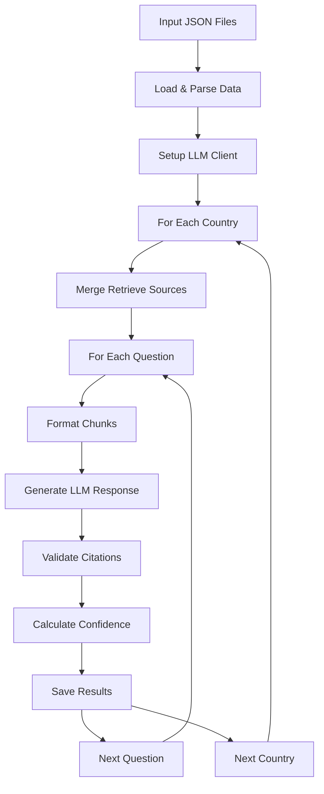
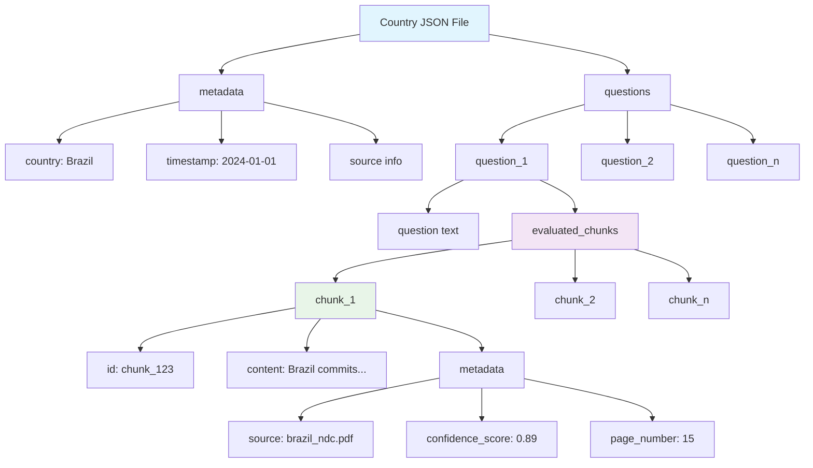
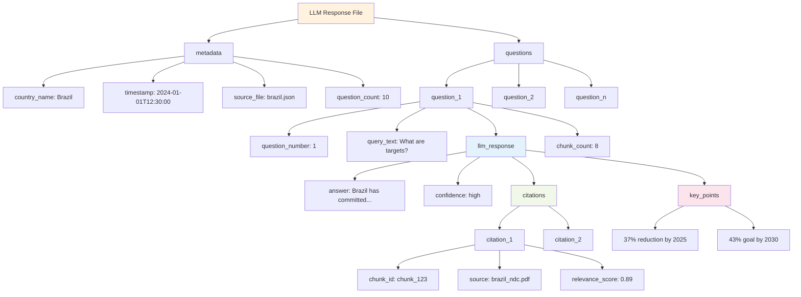
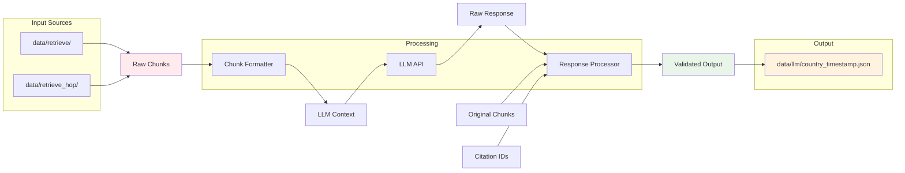

# LLM Response Module Documentation

---

## 📘 Table of Contents

1. [Overview](#overview)
2. [Core Functions](#core-functions)
3. [Processing Pipeline](#processing-pipeline)
4. [Helper Classes](#helper-classes)
5. [Input/Output Format](#inputoutput-format)
6. [Configuration](#configuration)
7. [Usage Examples](#usage-examples)
8. [Error Handling](#error-handling)

---

## Overview

The `5_llm_response.py` script is the brain of our RAG pipeline—it takes retrieved chunks from the previous stage and generates structured answers using a large language model. This isn't just a simple API call; it's a sophisticated processor that handles multiple retrieval sources, validates responses, and produces consistent JSON output.

**What it does**: Processes country-specific retrieved chunks through an LLM to generate structured answers with validated citations, confidence scoring, and proper metadata.

**Why it matters**: Raw chunks are useless without interpretation. This module transforms context into actionable insights while maintaining traceability through citation validation.

---

## Core Functions

| Function | Purpose | Key Logic |
|----------|---------|-----------|
| `setup_llm()` | Initialize LLM client | Configures API client with guided JSON support |
| `load_chunks_and_prompt_from_file()` | Parse input JSON | Flexible parser for multiple retrieval formats |
| `extract_main_question()` | Clean question text | Removes instructional formatting from prompts |
| `get_llm_response()` | Generate LLM answer | Formats context, calls API, returns structured response |
| `process_response()` | Validate output | Citation validation and final JSON formatting |
| `process_country_file()` | Handle country data | Orchestrates processing for all questions per country |
| `merge_chunks_from_directories()` | Combine sources | Merges retrieve + retrieve_hop data intelligently |

---

## Processing Pipeline



### The Workflow Explained

1. **Input Discovery**: Scans both `data/retrieve/` and `data/retrieve_hop/` for JSON files
2. **Data Merging**: Intelligently combines chunks from both retrieval strategies per question
3. **LLM Processing**: Formats context and generates structured responses using guided JSON
4. **Validation**: Ensures citations reference actual chunks and scores confidence
5. **Output**: Creates timestamped JSON files with complete metadata and traceability

---

## Helper Classes

### ChunkFormatter
Handles context preparation for the LLM:
- Formats chunk lists into readable context blocks
- Maintains chunk IDs for citation validation
- Optimizes context length for token limits

### LLMClient
Manages API interactions:
- **Guided JSON Mode**: Enforces response structure via API schema
- **Fallback Mode**: Parses unstructured responses with error handling
- **Configuration**: Uses environment variables for model, temperature, tokens

### ResponseProcessor
Validates and enriches LLM outputs:
- **Citation Validation**: Ensures all references exist in original chunks
- **Error Handling**: Creates consistent error responses for failures
- **Data Enrichment**: Adds chunk metadata to citations

### ConfidenceClassification
Scores response reliability:
- **Retrieval Quality**: Analyzes chunk relevance scores
- **Response Coherence**: Evaluates answer completeness
- **Citation Coverage**: Measures how well sources support claims

---

## Input/Output Format

### Input Structure Visualization



### Output Structure Visualization



### Data Flow Transformation



### Example JSON Structures

#### Input Example
```json
{
  "metadata": {
    "country": "Brazil",
    "timestamp": "2024-01-01T12:00:00"
  },
  "questions": {
    "question_1": {
      "question": "What are Brazil's emission targets?",
      "evaluated_chunks": [
        {
          "id": "chunk_123",
          "content": "Brazil commits to reducing emissions by 37%...",
          "metadata": {
            "source": "brazil_ndc.pdf",
            "confidence_score": 0.89
          }
        }
      ]
    }
  }
}
```

#### Output Example
```json
{
  "metadata": {
    "country_name": "Brazil",
    "timestamp": "2024-01-01T12:30:00",
    "source_file": "brazil.json",
    "question_count": 10
  },
  "questions": {
    "question_1": {
      "question_number": 1,
      "query_text": "What are Brazil's emission targets?",
      "llm_response": {
        "answer": "Brazil has committed to reducing greenhouse gas emissions by 37% below 2005 levels by 2025...",
        "confidence": "high",
        "citations": [
          {
            "chunk_id": "chunk_123",
            "source": "brazil_ndc.pdf",
            "relevance_score": 0.89
          }
        ],
        "key_points": [
          "37% reduction target by 2025",
          "Additional 43% goal by 2030"
        ]
      },
      "chunk_count": 8
    }
  }
}
```

---

## Configuration

### Environment Variables
| Variable | Purpose | Default |
|----------|---------|---------|
| `LLM_MODEL` | Model identifier | `meta-llama/Meta-Llama-3.1-70B-Instruct` |
| `LLM_TEMPERATURE` | Response randomness | `0.1` |
| `LLM_MAX_TOKENS` | Response length limit | `4000` |
| `AI_API_KEY` | API authentication | Required |
| `AI_BASE_URL` | API endpoint | Required |

### Guided JSON Support
The module automatically detects whether the LLM API supports guided JSON:
- **Enabled**: Enforces response structure via API schema for reliability
- **Disabled**: Falls back to regex parsing with error recovery

---

## Usage Examples

### Standard Operation
```bash
# Process all countries from retrieve directories
python 5_llm_response.py

# Override with custom prompt
python 5_llm_response.py --prompt "Summarize climate commitments"

# Disable guided JSON for compatibility
python 5_llm_response.py --no-guided-json
```

### Legacy Support
```bash
# Direct JSON input (legacy mode)
python 5_llm_response.py --chunks '[{"id":1,"content":"test"}]' --prompt "Analyze this"
```

---

## Error Handling

The module implements comprehensive error handling:

### Input Validation
- **Missing Files**: Graceful handling when directories don't exist
- **Malformed JSON**: Clear error messages for parsing failures
- **Missing Keys**: Flexible parsing that tries multiple data structures

### API Failures
- **Connection Issues**: Retry logic with exponential backoff
- **Rate Limits**: Automatic throttling and queue management
- **Parsing Errors**: Fallback to regex extraction when JSON fails

### Output Consistency
- **Failed Responses**: Creates error entries instead of crashing
- **Partial Success**: Continues processing other countries/questions
- **Logging**: Comprehensive logs for debugging and monitoring

The error responses maintain the same structure as successful ones, ensuring downstream processes can handle failures gracefully.

---

## Design Choices

### Why Merge Two Retrieval Sources?
The module combines data from `retrieve/` (semantic similarity) and `retrieve_hop/` (graph relationships) because each captures different aspects of relevance. This dual approach provides richer context for more comprehensive answers.

### Why Guided JSON?
Structured responses are critical for downstream processing. Guided JSON ensures consistency while fallback parsing maintains compatibility with simpler APIs.

### Why Per-Country Processing?
Climate policy documents are inherently country-specific. Processing by country ensures clear attribution and enables parallel processing for scale. 