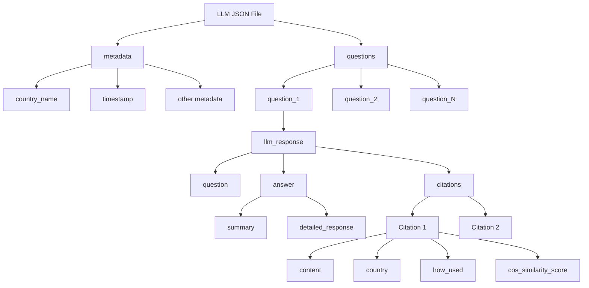
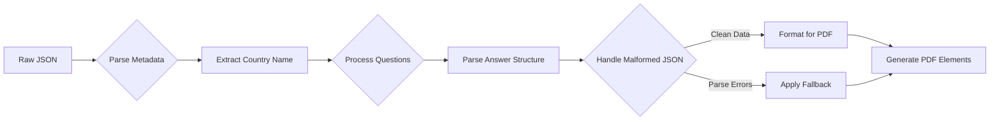
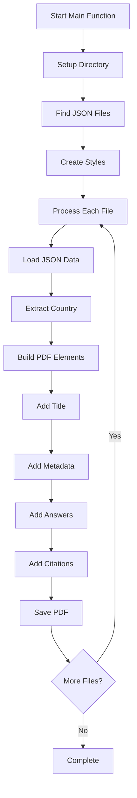
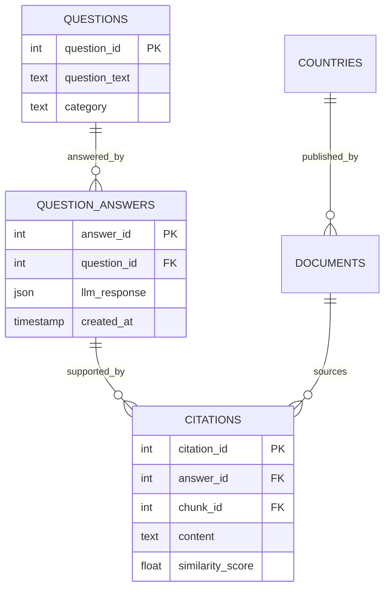

# Output Module Documentation

---

## 📘 Table of Contents

1. [Overview](#overview)
2. [Core Functions](#core-functions)
3. [Input Format](#input-format)
4. [PDF Generation Pipeline](#pdf-generation-pipeline)
5. [Styling System](#styling-system)
6. [Error Handling](#error-handling)
7. [Output Configuration](#output-configuration)
8. [Usage Examples](#usage-examples)
9. [Performance & Design Choices](#performance--design-choices)

---

## Overview

The `6_output.py` script is the final stage of our RAG pipeline, transforming structured LLM response data into professional PDF fact sheets. This isn't just a simple data formatter—it's a robust document generator that handles malformed JSON, implements sophisticated styling, and creates client-ready reports for climate policy analysis.

The module processes JSON files containing question-answer pairs, metadata, and citations, then generates country-specific PDF reports with professional styling, proper error handling, and structured content organization.

---

## Core Functions

### Function Overview

| Function | Role | Location | Input | Output |
|----------|------|----------|--------|--------|
| `ensure_output_directory()` | Directory management | Line 42 | None | Creates `outputs/factsheets/` |
| `get_available_llm_files()` | File discovery | Line 47 | None | List of JSON file paths |
| `load_llm_response_data()` | Data loading & parsing | Line 52 | JSON path | Country name + parsed data |
| `create_pdf_style()` | Style definition | Line 65 | None | ReportLab StyleSheet |
| `create_metadata_table()` | Metadata table generation | Line 138 | Response data + styles | ReportLab Table |
| `create_answer_section()` | Answer content formatting | Line 185 | Response data + styles | List of elements |
| `create_citations_section()` | Citation formatting | Line 277 | Response data + styles | List of elements |
| `generate_pdf_report()` | PDF assembly | Line 338 | Data + path + styles | PDF file |
| `main()` | Orchestration | Line 371 | None | Output directory path |

### Why This Function Structure?

Each function handles a specific aspect of PDF generation, making the system maintainable and testable. The separation between data processing (`load_llm_response_data`), styling (`create_pdf_style`), content generation (the `create_*` functions), and assembly (`generate_pdf_report`) allows for independent modification of each aspect.

---

## Input Format

### Expected JSON Structure

The module expects JSON files in the `data/llm/` directory with this structure:



### JSON Processing Flow



### Why This Input Structure?

The structure accommodates the output from our LLM analysis stage while being flexible enough to handle malformed JSON strings within the data. The metadata extraction allows for country-specific report generation, while the nested question structure supports multi-question fact sheets.

---

## PDF Generation Pipeline



### Processing Modules


### Element Generation Order

1. **Title Section**: Country-specific header with styled title
2. **Metadata Table**: Summary information (question count, citations, timestamp)
3. **Answer Sections**: Each question processed with summary/detailed breakdown
4. **Citations Section**: Grouped by country with relevance scores

This order ensures logical document flow while allowing for flexible content based on available data.

---

## Styling System

### Color Scheme Design

The module uses a professional color palette optimized for readability:

```python
COLORS = {
    'title': '#2C3E50',        # Dark blue for authority
    'heading': '#2980B9',      # Medium blue for section breaks
    'subheading': '#3498DB',   # Light blue for subsections
    'metadata_bg': '#ECF0F1',  # Subtle gray for data tables
    'summary_bg': '#E8F6F3',   # Light teal for key information
    'detail_bg': '#EBF5FB',    # Light blue for detailed content
    'citation_bg': '#FEF9E7',  # Light yellow for sources
    'border': '#D6DBDF'        # Consistent border color
}
```

### Typography Hierarchy

- **Title**: 16pt, centered, with border
- **Headings**: 14pt, colored background
- **Body**: 12pt, standard spacing
- **Citations**: 11pt, styled background

### Why These Design Choices?

The color scheme provides visual hierarchy without being distracting, crucial for professional policy documents. The typography sizes ensure readability while maintaining document density. Background colors help readers quickly identify different content types.

---

## Error Handling

### Malformed JSON Processing

The module includes sophisticated handling for common JSON corruption issues:

```python
# Handle nested JSON strings
if isinstance(summary, str) and summary.strip().startswith('{'):
    try:
        parsed_summary = json.loads(summary)
        if isinstance(parsed_summary, dict) and 'answer' in parsed_summary:
            summary = parsed_summary['answer'].get('summary', summary)
    except (json.JSONDecodeError, KeyError):
        # Fallback: clean up raw string
        summary = summary.replace('\\n', ' ').replace('\\"', '"')
```

### File Processing Resilience

- Missing files: Graceful skipping with user notification
- Parse errors: Fallback to error message in PDF
- Empty content: "Content not available" placeholders
- Directory issues: Automatic creation of output directories

### Why This Error Handling Strategy?

Real-world LLM outputs often contain malformed JSON due to response formatting issues. Rather than failing completely, the system attempts multiple parsing strategies before falling back to safe defaults, ensuring reports are generated even with imperfect data.

---

## Output Configuration

### File Naming Convention

```
{country_name}_climate_policy_factsheet_{timestamp}.pdf
```

Example: `Germany_climate_policy_factsheet_20241201_143022.pdf`

### Directory Structure

```
outputs/
└── factsheets/
    ├── Germany_climate_policy_factsheet_20241201_143022.pdf
    ├── France_climate_policy_factsheet_20241201_143025.pdf
    └── ...
```

### PDF Page Setup

- **Page Size**: US Letter (8.5" × 11")
- **Margins**: 1 inch on all sides
- **Font**: Helvetica (system standard)
- **Layout**: Single-column, structured sections

### Why These Configuration Choices?

The timestamp-based naming prevents file overwrites while maintaining readability. Letter size ensures compatibility with standard printing. Helvetica provides excellent readability across platforms and print media.

---

## Usage Examples

### Basic Usage

```bash
python entrypoints/6_output.py
```

This processes all JSON files in `data/llm/` and generates corresponding PDFs.

### Expected Output

```
[6_OUTPUT] Starting PDF generation from LLM response files...
[6_OUTPUT] Found 3 LLM response files
[6_OUTPUT] Processing: /path/to/data/llm/germany_responses.json
[6_OUTPUT] Generating PDF report for Germany...
[6_OUTPUT] PDF report generated: /path/to/outputs/factsheets/Germany_climate_policy_factsheet_20241201_143022.pdf
[6_OUTPUT] Report contains analysis of 5 questions for Germany
```

### Integration with Pipeline

```python
# Called as final stage after LLM analysis
from entrypoints.output import main as generate_reports

output_dir = generate_reports()
print(f"Reports generated in: {output_dir}")
```

---

## Performance & Design Choices

### Processing Efficiency

- **Batch Processing**: All files processed in single run
- **Memory Management**: Files processed individually, not loaded simultaneously
- **Style Reuse**: Single StyleSheet created and reused across documents

### PDF Generation Strategy

We chose ReportLab over alternatives like WeasyPrint because:
- **Precise Control**: Pixel-perfect styling control
- **Performance**: Faster for programmatic generation
- **Dependencies**: Fewer external dependencies
- **Reliability**: Mature library with excellent error handling

### Content Organization Philosophy

Each section is generated independently and assembled sequentially. This approach:
- Allows for flexible content based on data availability
- Enables easy modification of individual sections
- Facilitates debugging and testing
- Supports future feature additions (charts, tables, etc.)

### Scalability Considerations

The current design handles typical use cases (10-50 countries) efficiently. For larger scale deployment, consider:
- Parallel processing of multiple files
- Template-based styling systems
- Database integration for metadata tracking

---

## Database Integration

While the output module is file-based, it's designed to integrate with the broader RAG system's database schema:



The JSON input structure mirrors this database schema, allowing for seamless integration between stored analysis results and PDF generation.

---

**Generated by the DS205 RAG Pipeline Documentation System** 