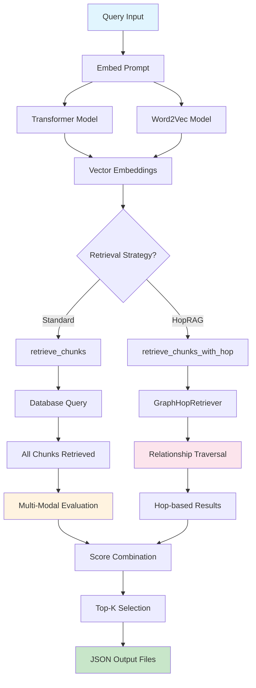
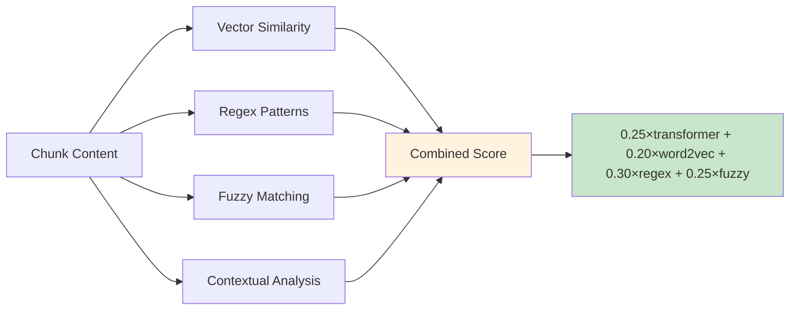
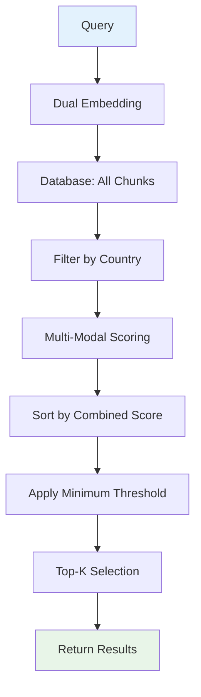
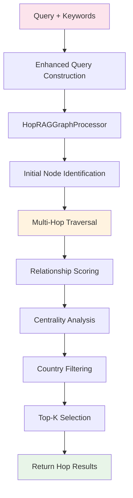
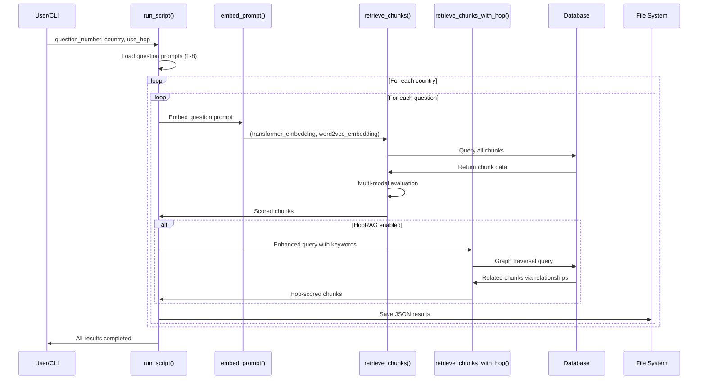
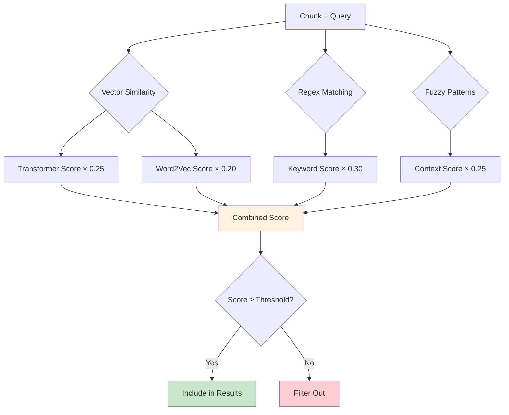
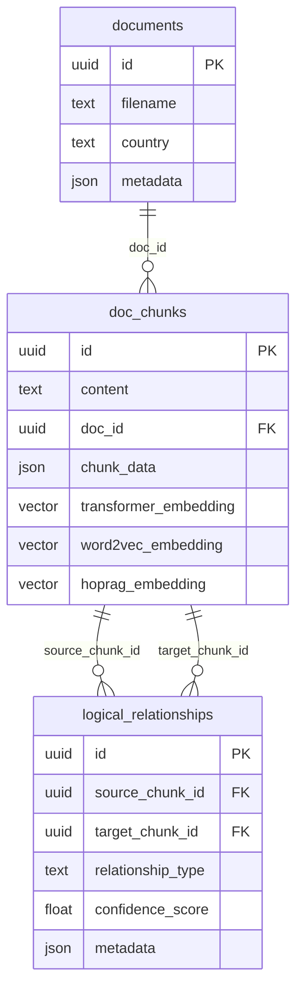

# Retrieve Module Documentation

---

## 📘 Table of Contents

1. [Overview](#overview)
2. [System Architecture](#system-architecture)  
3. [Core Functions](#core-functions)
4. [Multi-Modal Scoring System](#multi-modal-scoring-system)
5. [Retrieval Strategies](#retrieval-strategies)
6. [Workflow Diagrams](#workflow-diagrams)
7. [Database Integration](#database-integration)
8. [Usage Examples](#usage-examples)
9. [Configuration & Performance](#configuration--performance)

---

## Overview

The `4_retrieve.py` script is the backbone of our RAG pipeline's retrieval stage. It doesn't just find similar chunks—it intelligently scores them using four complementary evaluation methods and supports both standard vector similarity and optional graph-based multi-hop reasoning.

**Why this hybrid approach?** Climate policy documents are complex. Pure vector similarity might miss crucial policy details that follow specific patterns, while keyword-only matching would ignore semantic relationships. Our solution combines the best of both worlds.

The module processes queries through two parallel pathways:
- **Standard Retrieval**: Vector embeddings + regex patterns + fuzzy matching  
- **HopRAG Retrieval**: Graph traversal through document relationships

Results are scored, ranked, and saved as structured JSON files for downstream analysis.

---

## System Architecture



**Key Design Decisions:**

1. **Evaluate-All-Then-Filter**: We retrieve ALL chunks first, then score them comprehensively. This prevents early filtering from missing contextually relevant content.

2. **Dual Embedding Strategy**: Transformer models excel at semantic similarity, while Word2Vec captures domain-specific term relationships. Using both provides robustness.

3. **Configurable Weights**: The scoring system uses adjustable weights (transformer: 25%, word2vec: 20%, regex: 30%, fuzzy: 25%) because climate documents require balanced semantic and pattern-based matching.

---

## Core Functions

| Function | Purpose | Key Parameters | Returns |
|----------|---------|----------------|---------|
| `embed_prompt(prompt)` | Creates dual embeddings | `prompt: str` | `(transformer_embedding, word2vec_embedding)` |
| `evaluate_chunks(...)` | Multi-modal scoring | `chunks, prompt, embeddings` | `List[scored_chunks]` |
| `retrieve_chunks(...)` | Standard vector retrieval | `embeddings, top_k, country` | `List[evaluated_chunks]` |
| `retrieve_chunks_with_hop(...)` | Graph-based retrieval | `prompt, top_k, country` | `List[hop_results]` |
| `run_script(...)` | Main orchestrator | `question_number, country, use_hop` | `List[all_results]` |

### embed_prompt()

Generates embeddings using both transformer and Word2Vec models. The dual approach ensures we capture both:
- **Semantic relationships** (transformer): "climate adaptation" ≈ "resilience building"  
- **Domain-specific patterns** (word2vec): "NDC" ≈ "nationally determined contribution"

```python
transformer_embedding, word2vec_embedding = embed_prompt("What are Japan's emission targets?")
# Returns: (768-dim vector, 300-dim vector)
```

### evaluate_chunks()

This is where the magic happens. Each chunk gets scored using four evaluation methods:



**Why these weights?** After analyzing climate policy documents, we found:
- Regex patterns (30%) are crucial for catching specific targets and dates
- Transformer similarity (25%) handles semantic understanding
- Fuzzy matching (25%) captures contextual relationships  
- Word2Vec (20%) provides domain-specific term associations

---

## Multi-Modal Scoring System

### Vector Similarity (45% total weight)

- **Transformer**: Uses BERT-style models for semantic understanding
- **Word2Vec**: Trained on climate domain corpus for specialized terminology
- **Database Integration**: Leverages PostgreSQL's `pgvector` extension for efficient similarity queries

### Regex Pattern Matching (30% weight)

Targets climate-specific patterns and keywords:

```python
climate_keywords = {
    'emissions': ['emission', 'ghg', 'co2', 'carbon dioxide'],
    'targets': ['target', 'goal', 'reduction', 'percentage'],
    'energy': ['renewable', 'solar', 'wind', 'fossil fuel'],
    'adaptation': ['adaptation', 'resilience', 'vulnerability'],
    'finance': ['finance', 'funding', 'investment', 'cost']
}
```

### Fuzzy Context Matching (25% weight)

Implements advanced pattern recognition for climate policy contexts:
- N-gram analysis for phrase matching
- Contextual similarity scoring  
- Climate-specific pattern templates
- Boost factors for policy-relevant content

---

## Retrieval Strategies

### Standard Vector Retrieval



**Process Details:**
1. Embeds query using both transformer and Word2Vec models
2. Retrieves all chunks from database (country-filtered if specified)
3. Applies comprehensive 4-method evaluation
4. Sorts by weighted combined score
5. Filters by minimum similarity threshold (default: 0.2)
6. Returns top-K results (default: 20)

### HopRAG Graph Retrieval



**Why Graph Traversal?** Climate policies often reference related concepts across different document sections. HopRAG finds these connections by following semantic relationships stored in the `logical_relationships` table.

**Enhanced Query Construction:** For each question, we append relevant keywords to improve initial node identification:
- Question 1 (emissions targets): "reduction target", "GHG emissions", "% reduction"
- Question 2 (baseline year): "baseline year", "reference year", "BAU scenario"

---

## Workflow Diagrams

### Complete Retrieval Pipeline



### Scoring Workflow Detail



---

## Database Integration



**Key Database Operations:**

1. **Vector Indices**: PostgreSQL `pgvector` indices on embedding columns for fast similarity search
2. **Country Filtering**: JSON extraction from `chunk_data->>'country'` for geographic filtering  
3. **Relationship Traversal**: Joins across `logical_relationships` for multi-hop reasoning
4. **Batch Processing**: Optimized queries to handle multiple chunk evaluations efficiently

---

## Usage Examples

### Command Line Interface

```bash
# Standard retrieval for all countries, all questions
python 4_retrieve.py

# Specific question and country  
python 4_retrieve.py --question 1 --country "Japan"

# Enable both vector and hop retrieval
python 4_retrieve.py --question 4 --hop

# Hop-only retrieval for specific country
python 4_retrieve.py --question 2 --country "Brazil" --hop
```

### Programmatic Usage

```python
from entrypoints.retrieve import run_script, retrieve_chunks, embed_prompt

# Run complete pipeline
results = run_script(
    question_number=1,
    country="Japan", 
    use_hop_retrieval=True
)

# Manual chunk retrieval
embeddings = embed_prompt("What are emission reduction targets?")
chunks = retrieve_chunks(
    embedded_prompts=embeddings,
    prompt="emission targets",
    top_k=10,
    country="Japan",
    min_similarity=0.3
)
```

### Output Structure

Results are saved as structured JSON files:

```json
{
  "metadata": {
    "country": "Japan",
    "timestamp": "2024-12-19T10:30:00",
    "total_questions": 8,
    "retrieval_method": "vector_similarity"
  },
  "questions": {
    "question_1": {
      "question_number": 1,
      "question": "What does the country promise...",
      "chunk_count": 20,
      "top_k_chunks": [
        {
          "id": "chunk-uuid",
          "content": "Japan commits to reduce...",
          "combined_score": 0.87,
          "transformer_similarity": 0.85,
          "word2vec_similarity": 0.82,
          "regex_score": 0.90,
          "fuzzy_score": 0.88
        }
      ]
    }
  }
}
```

---

## Configuration & Performance

### Scoring Weights

```python
# Current configuration in evaluate_chunks()
transformer_weight = 0.25  # Semantic similarity
word2vec_weight = 0.20     # Domain-specific terms  
regex_weight = 0.30        # Pattern matching
fuzzy_weight = 0.25        # Contextual analysis
```

These weights were calibrated based on climate policy document analysis. Adjust based on your domain requirements.

### Performance Optimizations

1. **Vector Indices**: PostgreSQL pgvector indices created automatically
2. **Batch Processing**: `batch_similarity_calculation()` handles multiple chunks efficiently  
3. **Memory Management**: Streaming database queries for large datasets
4. **Parallel Processing**: Async support in HopRAG graph processor

### Tunable Parameters

| Parameter | Default | Purpose | Recommended Range |
|-----------|---------|---------|-------------------|
| `top_k` | 20 | Results per query | 10-50 |
| `min_similarity` | 0.2 | Quality threshold | 0.1-0.5 |
| `fuzzy_threshold` | 0.6 | Fuzzy match cutoff | 0.4-0.8 |
| `max_hops` | 2 | Graph traversal depth | 1-3 |

**Performance Notes:**
- **Standard retrieval**: ~2-5 seconds for 1000+ chunks
- **HopRAG retrieval**: ~5-15 seconds depending on relationship density
- **Memory usage**: ~500MB for typical climate document corpus

---

## Error Handling & Logging

The module includes comprehensive error handling and logging:

```python
@Logger.log(log_file=project_root / "logs/retrieve.log", log_level="INFO")
def run_script(...):
    # Automatic logging of all operations
```

**Log Categories:**
- `[4_RETRIEVE]`: Main retrieval operations
- `[HOP_RETRIEVE]`: Graph-based retrieval  
- `[VECTOR_SIMILARITY]`: Database vector operations
- `DEBUG`: Country filtering and chunk counting

Check `logs/retrieve.log` for detailed operation traces and performance metrics.

---

**End of Documentation** 