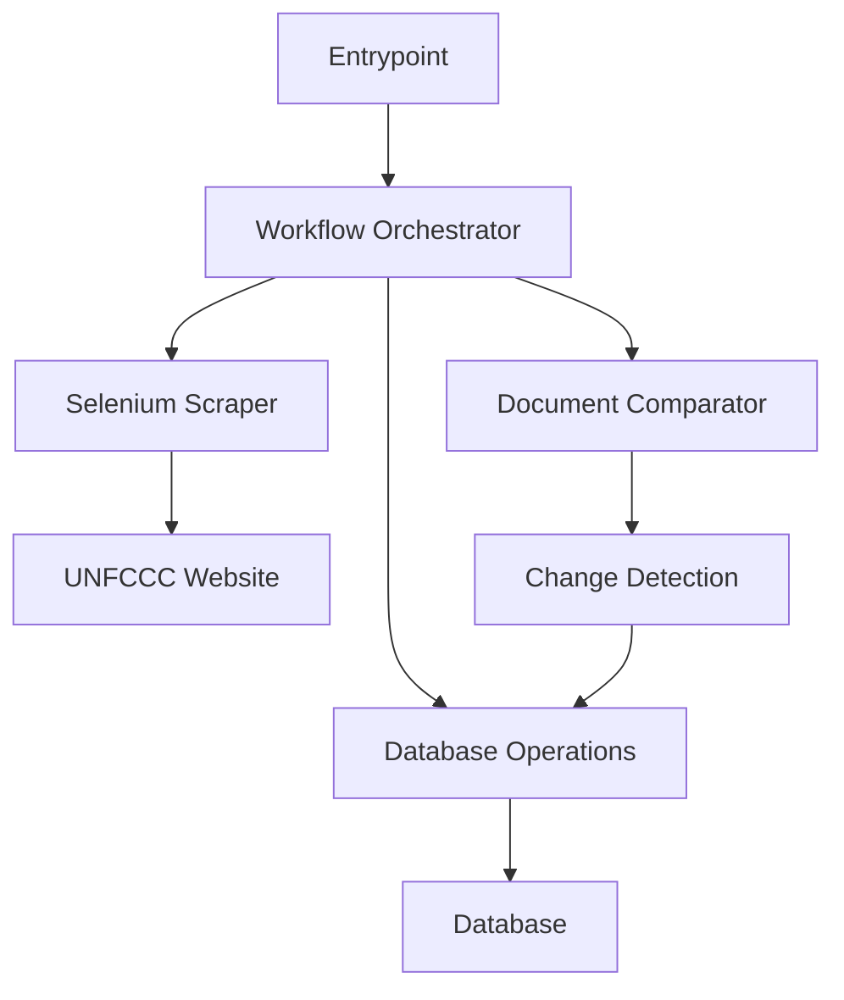

# Scrape Module Documentation

## Table of Contents

- [Overview](#overview)
- [Architecture](#architecture)
- [API Reference](#api-reference)
- [Configuration](#configuration)
- [Error Handling](#error-handling)
- [Usage Patterns](#usage-patterns)
- [Testing](#testing)
- [Performance Considerations](#performance-considerations)
- [Troubleshooting](#troubleshooting)
- [Contributing](#contributing)

## Overview

The `scrape` module provides a robust, production-ready solution for scraping, comparing, and updating NDC (Nationally Determined Contributions) documents from the UNFCCC registry. It follows clean architecture principles with clear separation of concerns, comprehensive error handling, and configurable behavior.

### Key Features

- **Lightweight Entrypoint**: Minimal orchestration layer (25 lines vs 375 lines)
- **Modular Architecture**: Seven focused modules with single responsibilities
- **Custom Exception Hierarchy**: Precise error categorization and handling
- **Configuration Management**: Flexible deployment and runtime configuration
- **Production Ready**: Comprehensive logging, monitoring, and error recovery

### Design Principles

- **SOLID Principles**: Single responsibility, open/closed, dependency inversion
- **Clean Architecture**: Clear layer boundaries and dependency direction
- **Fail-Fast**: Early error detection with specific exception types
- **Observability**: Detailed logging and workflow metrics

## Architecture

### Module Structure

```
group4py/src/scrape/
├── __init__.py           # Public API exports
├── workflow.py           # Orchestration layer
├── db_operations.py      # Data access layer
├── comparator.py         # Business logic layer
├── id_generator.py       # Utility layer
├── config.py             # Configuration management
└── exceptions.py         # Custom exception hierarchy
```

### Layer Responsibilities

#### Orchestration Layer (`workflow.py`)
- Coordinates the complete scraping workflow
- Handles high-level error management and recovery
- Provides comprehensive logging and reporting
- Returns structured results for monitoring

#### Data Access Layer (`db_operations.py`)
- Encapsulates all database interactions
- Handles data model conversions between layers
- Manages database sessions and transactions
- Provides clean error handling with custom exceptions

#### Business Logic Layer (`comparator.py`)
- Pure comparison logic without side effects
- Document difference detection algorithms
- Easily testable and maintainable
- Focused on domain-specific operations

#### Utility Layer (`id_generator.py`)
- Single-purpose utility functions
- Robust error handling with fallbacks
- URL parsing and sanitization
- Deterministic ID generation

### Data Flow



## API Reference

### Core Functions

#### `run_scraping_workflow(config: Optional[ScrapingConfig] = None) -> Dict[str, Any]`

Executes the complete NDC document scraping workflow.

**Parameters:**
- `config` (Optional[ScrapingConfig]): Configuration for scraping operations. Defaults to `DEFAULT_CONFIG`.

**Returns:**
- `Dict[str, Any]`: Workflow results and statistics containing:
  - `existing_count`: Number of documents in database
  - `scraped_count`: Number of documents scraped from website
  - `new_count`: Number of new documents found
  - `updated_count`: Number of documents with changes
  - `removed_count`: Number of documents no longer on website
  - `inserted_count`: Number of documents successfully inserted
  - `updated_actual_count`: Number of documents successfully updated
  - `success`: Boolean indicating workflow success

**Raises:**
- `WorkflowError`: If workflow execution fails
- `DocumentScrapingError`: If document scraping fails
- `DatabaseConnectionError`: If database connection fails

**Example:**
```python
from group4py.src.scrape import run_scraping_workflow

try:
    result = run_scraping_workflow()
    print(f"Processed {result['inserted_count']} new documents")
    print(f"Updated {result['updated_actual_count']} existing documents")
except WorkflowError as e:
    logger.error(f"Workflow failed: {e}")
```

### Database Operations

#### `retrieve_existing_documents() -> List[NDCDocumentModel]`

Retrieves all existing documents from the database.

**Returns:**
- `List[NDCDocumentModel]`: List of documents currently in the database

**Raises:**
- `DatabaseConnectionError`: If database connection or query fails

#### `insert_new_documents(new_docs: List[NDCDocumentBase]) -> int`

Inserts new documents into the database.

**Parameters:**
- `new_docs` (List[NDCDocumentBase]): List of new documents to insert

**Returns:**
- `int`: Number of successfully inserted documents

**Raises:**
- `DatabaseConnectionError`: If database connection fails
- `DocumentValidationError`: If document validation fails

#### `update_existing_documents(updated_docs: List[NDCDocumentBase]) -> int`

Updates existing documents in the database with new metadata.

**Parameters:**
- `updated_docs` (List[NDCDocumentBase]): List of documents with updated metadata

**Returns:**
- `int`: Number of successfully updated documents

**Raises:**
- `DatabaseConnectionError`: If database connection fails

### Comparison Operations

#### `compare_documents(existing_docs: List[NDCDocumentModel], new_docs: List[NDCDocumentBase]) -> Dict[str, List[Union[NDCDocumentModel, NDCDocumentBase]]]`

Compares existing and new documents to find differences.

**Parameters:**
- `existing_docs` (List[NDCDocumentModel]): Documents currently in database
- `new_docs` (List[NDCDocumentBase]): Documents scraped from website

**Returns:**
- `Dict[str, List[Union[NDCDocumentModel, NDCDocumentBase]]]`: Dictionary containing:
  - `new`: Documents found on website but not in database
  - `updated`: Documents with changed metadata
  - `removed`: Documents in database but not on website

### Utility Functions

#### `generate_doc_id(url: str) -> str`

Generates document ID from PDF URL by extracting the filename.

**Parameters:**
- `url` (str): PDF URL

**Returns:**
- `str`: Document ID based on PDF filename, with fallback to hash

## Configuration

### ScrapingConfig

The `ScrapingConfig` dataclass provides comprehensive configuration options:

```python
@dataclass
class ScrapingConfig:
    # Selenium settings
    headless: bool = True              # Run browser in headless mode
    timeout: int = 30                  # Page load timeout in seconds
    max_retries: int = 3               # Maximum retry attempts
    retry_delay: int = 5               # Delay between retries in seconds
    
    # Logging settings
    log_removed_limit: int = 5         # Number of removed docs to log
    
    # Database settings
    batch_size: Optional[int] = None   # Batch size for database operations
    
    # Workflow settings
    abort_on_no_docs: bool = True      # Abort if no documents scraped
    process_removed_docs: bool = False # Process removed documents
```

### Configuration Examples

#### Development Configuration
```python
from group4py.src.scrape import ScrapingConfig, run_scraping_workflow

dev_config = ScrapingConfig(
    headless=False,           # Show browser for debugging
    timeout=60,               # Longer timeout for slow connections
    log_removed_limit=10,     # Log more removed documents
    abort_on_no_docs=False    # Continue even if no docs scraped
)

result = run_scraping_workflow(dev_config)
```

#### Production Configuration
```python
prod_config = ScrapingConfig(
    headless=True,            # Headless for server deployment
    timeout=30,               # Standard timeout
    max_retries=5,            # More retries for reliability
    retry_delay=10,           # Longer delay between retries
    process_removed_docs=True # Process removed documents
)

result = run_scraping_workflow(prod_config)
```

#### Testing Configuration
```python
test_config = ScrapingConfig(
    headless=True,
    timeout=15,               # Faster timeout for tests
    max_retries=1,            # Single retry for speed
    abort_on_no_docs=False,   # Don't abort in test scenarios
    log_removed_limit=0       # Minimal logging
)
```

## Error Handling

### Exception Hierarchy

```
ScrapeError (base)
├── DatabaseConnectionError    # Database connectivity issues
├── DocumentScrapingError     # Web scraping failures
├── DocumentValidationError   # Document validation failures
└── WorkflowError            # Workflow execution failures
```

### Exception Details

#### `ScrapeError`
Base exception for all scraping operations. Inherit from this for custom exceptions.

#### `DatabaseConnectionError`
Raised when database connection fails or database operations encounter errors.

**Common Causes:**
- Database server unavailable
- Invalid connection credentials
- Network connectivity issues
- SQL query errors

#### `DocumentScrapingError`
Raised when document scraping from the website fails.

**Common Causes:**
- Website unavailable or changed structure
- Selenium WebDriver issues
- Network timeouts
- Anti-bot detection

#### `DocumentValidationError`
Raised when document validation fails during processing.

**Common Causes:**
- Invalid document metadata
- Missing required fields
- Data type mismatches
- URL parsing errors

#### `WorkflowError`
Raised when workflow execution fails due to unexpected errors.

**Common Causes:**
- Unhandled exceptions in workflow steps
- Configuration errors
- Resource exhaustion
- System-level failures

### Error Handling Patterns

#### Basic Error Handling
```python
from group4py.src.scrape import (
    run_scraping_workflow,
    DatabaseConnectionError,
    DocumentScrapingError,
    WorkflowError
)

try:
    result = run_scraping_workflow()
    logger.info(f"Workflow completed successfully: {result}")
except DatabaseConnectionError as e:
    logger.error(f"Database error: {e}")
    # Implement database retry logic
except DocumentScrapingError as e:
    logger.error(f"Scraping error: {e}")
    # Implement scraping retry logic
except WorkflowError as e:
    logger.error(f"Workflow error: {e}")
    # Implement workflow recovery logic
```

#### Advanced Error Handling with Retry Logic
```python
import time
from typing import Optional

def run_scraping_with_retry(
    max_attempts: int = 3,
    retry_delay: int = 60,
    config: Optional[ScrapingConfig] = None
) -> Dict[str, Any]:
    """Run scraping workflow with retry logic."""
    
    for attempt in range(max_attempts):
        try:
            return run_scraping_workflow(config)
        except DatabaseConnectionError as e:
            if attempt < max_attempts - 1:
                logger.warning(f"Database error on attempt {attempt + 1}: {e}")
                time.sleep(retry_delay)
                continue
            raise
        except DocumentScrapingError as e:
            if attempt < max_attempts - 1:
                logger.warning(f"Scraping error on attempt {attempt + 1}: {e}")
                time.sleep(retry_delay)
                continue
            raise
        except WorkflowError as e:
            # Don't retry workflow errors
            raise
    
    raise WorkflowError(f"Failed after {max_attempts} attempts")
```

## Usage Patterns

### Basic Usage

#### Simple Workflow Execution
```python
from group4py.src.scrape import run_scraping_workflow

# Execute with default configuration
result = run_scraping_workflow()

# Check results
if result['success']:
    print(f"✅ Workflow completed successfully")
    print(f"📊 New documents: {result['inserted_count']}")
    print(f"🔄 Updated documents: {result['updated_actual_count']}")
else:
    print("❌ Workflow failed")
```

#### Custom Configuration
```python
from group4py.src.scrape import run_scraping_workflow, ScrapingConfig

# Create custom configuration
config = ScrapingConfig(
    headless=False,
    timeout=60,
    process_removed_docs=True
)

# Execute with custom configuration
result = run_scraping_workflow(config)
```

### Advanced Usage Patterns

#### Monitoring and Alerting
```python
import logging
from datetime import datetime
from group4py.src.scrape import run_scraping_workflow, ScrapingConfig

def monitored_scraping_workflow():
    """Execute scraping workflow with comprehensive monitoring."""
    
    start_time = datetime.now()
    logger.info(f"Starting scraping workflow at {start_time}")
    
    try:
        result = run_scraping_workflow()
        
        # Log success metrics
        duration = datetime.now() - start_time
        logger.info(f"Workflow completed in {duration.total_seconds():.2f} seconds")
        
        # Check for anomalies
        if result['new_count'] > 100:
            logger.warning(f"Unusually high number of new documents: {result['new_count']}")
        
        if result['removed_count'] > 50:
            logger.warning(f"Unusually high number of removed documents: {result['removed_count']}")
        
        # Send success notification
        send_notification("Scraping workflow completed successfully", result)
        
        return result
        
    except Exception as e:
        duration = datetime.now() - start_time
        logger.error(f"Workflow failed after {duration.total_seconds():.2f} seconds: {e}")
        
        # Send failure notification
        send_alert("Scraping workflow failed", str(e))
        raise

def send_notification(message: str, data: dict):
    """Send success notification (implement based on your notification system)."""
    pass

def send_alert(message: str, error: str):
    """Send failure alert (implement based on your alerting system)."""
    pass
```

#### Batch Processing with Rate Limiting
```python
import time
from typing import List
from group4py.src.scrape import ScrapingConfig, run_scraping_workflow

def batch_scraping_workflow(
    configs: List[ScrapingConfig],
    rate_limit_delay: int = 300  # 5 minutes between batches
) -> List[Dict[str, Any]]:
    """Execute multiple scraping workflows with rate limiting."""
    
    results = []
    
    for i, config in enumerate(configs):
        logger.info(f"Executing batch {i + 1}/{len(configs)}")
        
        try:
            result = run_scraping_workflow(config)
            results.append(result)
            
            # Rate limiting between batches
            if i < len(configs) - 1:
                logger.info(f"Waiting {rate_limit_delay} seconds before next batch")
                time.sleep(rate_limit_delay)
                
        except Exception as e:
            logger.error(f"Batch {i + 1} failed: {e}")
            results.append({'success': False, 'error': str(e)})
    
    return results
```

#### Integration with Scheduling Systems
```python
import schedule
import time
from group4py.src.scrape import run_scraping_workflow, ScrapingConfig

def scheduled_scraping():
    """Scheduled scraping function for cron jobs or task schedulers."""
    
    config = ScrapingConfig(
        headless=True,
        timeout=45,
        max_retries=3,
        process_removed_docs=True
    )
    
    try:
        result = run_scraping_workflow(config)
        logger.info(f"Scheduled scraping completed: {result}")
        return result
    except Exception as e:
        logger.error(f"Scheduled scraping failed: {e}")
        raise

# Schedule daily scraping at 2 AM
schedule.every().day.at("02:00").do(scheduled_scraping)

# Schedule hourly scraping during business hours
schedule.every().hour.at(":00").do(scheduled_scraping).tag('business_hours')

def run_scheduler():
    """Run the scheduler loop."""
    while True:
        schedule.run_pending()
        time.sleep(60)
```

## Testing

### Unit Testing

#### Testing Database Operations
```python
import pytest
from unittest.mock import Mock, patch
from group4py.src.scrape.db_operations import retrieve_existing_documents
from group4py.src.scrape.exceptions import DatabaseConnectionError

class TestDatabaseOperations:
    
    @patch('group4py.src.scrape.db_operations.Connection')
    def test_retrieve_existing_documents_success(self, mock_connection):
        """Test successful document retrieval."""
        # Setup
        mock_db = Mock()
        mock_session = Mock()
        mock_connection.return_value = mock_db
        mock_db.connect.return_value = True
        mock_db.get_session.return_value = mock_session
        mock_session.query.return_value.all.return_value = []
        
        # Execute
        result = retrieve_existing_documents()
        
        # Assert
        assert isinstance(result, list)
        mock_db.connect.assert_called_once()
        mock_session.close.assert_called_once()
    
    @patch('group4py.src.scrape.db_operations.Connection')
    def test_retrieve_existing_documents_connection_failure(self, mock_connection):
        """Test database connection failure."""
        # Setup
        mock_db = Mock()
        mock_connection.return_value = mock_db
        mock_db.connect.return_value = False
        
        # Execute & Assert
        with pytest.raises(DatabaseConnectionError):
            retrieve_existing_documents()
```

#### Testing Workflow Logic
```python
import pytest
from unittest.mock import Mock, patch
from group4py.src.scrape.workflow import run_scraping_workflow
from group4py.src.scrape.config import ScrapingConfig
from group4py.src.scrape.exceptions import DocumentScrapingError

class TestWorkflow:
    
    @patch('group4py.src.scrape.workflow.retrieve_existing_documents')
    @patch('group4py.src.scrape.workflow.scrape_ndc_documents')
    @patch('group4py.src.scrape.workflow.compare_documents')
    @patch('group4py.src.scrape.workflow.insert_new_documents')
    def test_workflow_success(self, mock_insert, mock_compare, mock_scrape, mock_retrieve):
        """Test successful workflow execution."""
        # Setup
        mock_retrieve.return_value = []
        mock_scrape.return_value = [Mock()]
        mock_compare.return_value = {'new': [Mock()], 'updated': [], 'removed': []}
        mock_insert.return_value = 1
        
        config = ScrapingConfig()
        
        # Execute
        result = run_scraping_workflow(config)
        
        # Assert
        assert result['success'] is True
        assert result['inserted_count'] == 1
        mock_retrieve.assert_called_once()
        mock_scrape.assert_called_once_with(headless=True, timeout=30)
    
    @patch('group4py.src.scrape.workflow.retrieve_existing_documents')
    @patch('group4py.src.scrape.workflow.scrape_ndc_documents')
    def test_workflow_scraping_failure(self, mock_scrape, mock_retrieve):
        """Test workflow failure during scraping."""
        # Setup
        mock_retrieve.return_value = []
        mock_scrape.side_effect = Exception("Scraping failed")
        
        # Execute & Assert
        with pytest.raises(DocumentScrapingError):
            run_scraping_workflow()
```

### Integration Testing

#### End-to-End Testing
```python
import pytest
from group4py.src.scrape import run_scraping_workflow, ScrapingConfig

class TestIntegration:
    
    @pytest.mark.integration
    def test_full_workflow_integration(self):
        """Test complete workflow integration."""
        config = ScrapingConfig(
            headless=True,
            timeout=15,
            abort_on_no_docs=False
        )
        
        try:
            result = run_scraping_workflow(config)
            
            # Verify result structure
            assert 'success' in result
            assert 'existing_count' in result
            assert 'scraped_count' in result
            assert 'inserted_count' in result
            assert 'updated_actual_count' in result
            
            # Verify data types
            assert isinstance(result['existing_count'], int)
            assert isinstance(result['scraped_count'], int)
            assert isinstance(result['success'], bool)
            
        except Exception as e:
            pytest.fail(f"Integration test failed: {e}")
```

### Test Configuration

#### pytest.ini
```ini
[tool:pytest]
markers =
    unit: Unit tests
    integration: Integration tests
    slow: Slow tests that may take several minutes
    
testpaths = tests
python_files = test_*.py
python_classes = Test*
python_functions = test_*

# Test coverage configuration
addopts = 
    --cov=group4py.src.scrape
    --cov-report=html
    --cov-report=term-missing
    --cov-fail-under=90
```

## Performance Considerations

### Optimization Strategies

#### Database Optimization
- **Connection Pooling**: Reuse database connections for multiple operations
- **Batch Operations**: Process documents in batches to reduce database round trips
- **Indexing**: Ensure proper indexing on URL and doc_id fields
- **Query Optimization**: Use efficient queries for document retrieval and updates

#### Selenium Optimization
- **Headless Mode**: Use headless browser for production deployments
- **Resource Management**: Properly close WebDriver instances
- **Timeout Configuration**: Set appropriate timeouts for different environments
- **Anti-Detection**: Implement proper delays and user agent rotation

#### Memory Management
- **Streaming Processing**: Process large document sets in chunks
- **Garbage Collection**: Explicitly clean up large objects
- **Memory Monitoring**: Monitor memory usage during long-running operations

### Performance Monitoring

#### Metrics Collection
```python
import time
import psutil
from typing import Dict, Any

class PerformanceMonitor:
    """Monitor performance metrics during scraping operations."""
    
    def __init__(self):
        self.start_time = None
        self.start_memory = None
        self.metrics = {}
    
    def start_monitoring(self):
        """Start performance monitoring."""
        self.start_time = time.time()
        self.start_memory = psutil.Process().memory_info().rss / 1024 / 1024  # MB
    
    def stop_monitoring(self) -> Dict[str, Any]:
        """Stop monitoring and return metrics."""
        if self.start_time is None:
            return {}
        
        end_time = time.time()
        end_memory = psutil.Process().memory_info().rss / 1024 / 1024  # MB
        
        return {
            'duration_seconds': end_time - self.start_time,
            'memory_start_mb': self.start_memory,
            'memory_end_mb': end_memory,
            'memory_delta_mb': end_memory - self.start_memory,
            'cpu_percent': psutil.cpu_percent()
        }

# Usage example
def monitored_workflow():
    monitor = PerformanceMonitor()
    monitor.start_monitoring()
    
    try:
        result = run_scraping_workflow()
        metrics = monitor.stop_monitoring()
        
        logger.info(f"Performance metrics: {metrics}")
        return result, metrics
        
    except Exception as e:
        metrics = monitor.stop_monitoring()
        logger.error(f"Workflow failed. Performance metrics: {metrics}")
        raise
```

### Scalability Considerations

#### Horizontal Scaling
- **Distributed Processing**: Split document processing across multiple workers
- **Queue-Based Architecture**: Use message queues for asynchronous processing
- **Load Balancing**: Distribute scraping load across multiple instances

#### Vertical Scaling
- **Resource Allocation**: Optimize CPU and memory allocation
- **Concurrent Processing**: Use threading or async processing where appropriate
- **Database Scaling**: Scale database resources based on document volume

## Troubleshooting

### Common Issues

#### Database Connection Issues

**Symptoms:**
- `DatabaseConnectionError` exceptions
- Timeout errors during database operations
- Connection pool exhaustion

**Solutions:**
```python
# Check database connectivity
from group4py.src.database import Connection

def test_database_connection():
    """Test database connectivity."""
    try:
        db = Connection()
        if db.connect():
            print("✅ Database connection successful")
            return True
        else:
            print("❌ Database connection failed")
            return False
    except Exception as e:
        print(f"❌ Database connection error: {e}")
        return False

# Verify environment variables
import os
print(f"DATABASE_URL: {os.environ.get('DATABASE_URL', 'Not set')}")
```

#### Selenium WebDriver Issues

**Symptoms:**
- `DocumentScrapingError` exceptions
- Browser crashes or hangs
- Element not found errors

**Solutions:**
```python
# Test Selenium setup
from selenium import webdriver
from selenium.webdriver.chrome.options import Options

def test_selenium_setup():
    """Test Selenium WebDriver setup."""
    try:
        options = Options()
        options.add_argument("--headless")
        options.add_argument("--no-sandbox")
        
        driver = webdriver.Chrome(options=options)
        driver.get("https://www.google.com")
        print("✅ Selenium WebDriver working")
        driver.quit()
        return True
    except Exception as e:
        print(f"❌ Selenium WebDriver error: {e}")
        return False

# Update ChromeDriver
from webdriver_manager.chrome import ChromeDriverManager
ChromeDriverManager().install()
```

#### Memory Issues

**Symptoms:**
- Out of memory errors
- Slow performance with large document sets
- System resource exhaustion

**Solutions:**
```python
# Monitor memory usage
import psutil

def check_system_resources():
    """Check available system resources."""
    memory = psutil.virtual_memory()
    cpu = psutil.cpu_percent(interval=1)
    
    print(f"Memory: {memory.percent}% used ({memory.available / 1024 / 1024:.0f} MB available)")
    print(f"CPU: {cpu}% used")
    
    if memory.percent > 90:
        print("⚠️  High memory usage detected")
    if cpu > 90:
        print("⚠️  High CPU usage detected")

# Process documents in smaller batches
config = ScrapingConfig(batch_size=100)  # Process 100 documents at a time
```

### Debugging Tools

#### Logging Configuration
```python
import logging

def setup_debug_logging():
    """Setup detailed logging for debugging."""
    logging.basicConfig(
        level=logging.DEBUG,
        format='%(asctime)s - %(name)s - %(levelname)s - %(message)s',
        handlers=[
            logging.FileHandler('debug.log'),
            logging.StreamHandler()
        ]
    )
    
    # Enable SQL logging
    logging.getLogger('sqlalchemy.engine').setLevel(logging.INFO)
    
    # Enable Selenium logging
    logging.getLogger('selenium').setLevel(logging.DEBUG)
```

#### Diagnostic Functions
```python
def run_diagnostics():
    """Run comprehensive system diagnostics."""
    print("🔍 Running system diagnostics...")
    
    # Test database connection
    db_status = test_database_connection()
    
    # Test Selenium setup
    selenium_status = test_selenium_setup()
    
    # Check system resources
    check_system_resources()
    
    # Test configuration
    from group4py.src.scrape import DEFAULT_CONFIG
    print(f"Default config: {DEFAULT_CONFIG}")
    
    # Summary
    print("\n📊 Diagnostic Summary:")
    print(f"Database: {'✅' if db_status else '❌'}")
    print(f"Selenium: {'✅' if selenium_status else '❌'}")
    
    return db_status and selenium_status
```

## Contributing

### Development Setup

#### Environment Setup
```bash
# Clone repository
git clone <repository-url>
cd rag-fact-sheets-4

# Create virtual environment
python -m venv group4venv
source group4venv/bin/activate  # On Windows: group4venv\Scripts\activate

# Install dependencies
pip install -r requirements/dev.txt

# Install pre-commit hooks
pre-commit install
```

#### Code Quality Standards

#### Linting and Formatting
```bash
# Run black formatter
black group4py/src/scrape/

# Run isort for import sorting
isort group4py/src/scrape/

# Run flake8 for linting
flake8 group4py/src/scrape/

# Run mypy for type checking
mypy group4py/src/scrape/
```

#### Testing Requirements
```bash
# Run unit tests
pytest tests/unit/

# Run integration tests
pytest tests/integration/ -m integration

# Run all tests with coverage
pytest --cov=group4py.src.scrape --cov-report=html
```

### Contribution Guidelines

#### Code Standards
- **Type Hints**: All functions must have complete type annotations
- **Docstrings**: All public functions must have comprehensive docstrings
- **Error Handling**: Use custom exceptions with proper error chaining
- **Logging**: Include appropriate logging at INFO, WARNING, and ERROR levels
- **Testing**: Maintain 90%+ test coverage for new code

#### Pull Request Process
1. **Feature Branch**: Create feature branch from `main`
2. **Implementation**: Implement changes following code standards
3. **Testing**: Add comprehensive tests for new functionality
4. **Documentation**: Update documentation for API changes
5. **Review**: Submit pull request with detailed description
6. **CI/CD**: Ensure all automated checks pass

#### Architecture Decisions
- **Single Responsibility**: Each module should have one clear purpose
- **Dependency Injection**: Use dependency injection for testability
- **Error Boundaries**: Implement clear error boundaries between layers
- **Configuration**: Make behavior configurable rather than hardcoded
- **Observability**: Include comprehensive logging and metrics

### Release Process

#### Version Management
- **Semantic Versioning**: Follow semver (MAJOR.MINOR.PATCH)
- **Changelog**: Maintain detailed changelog for each release
- **Migration Guides**: Provide migration guides for breaking changes

#### Release Checklist
- [ ] All tests passing
- [ ] Documentation updated
- [ ] Performance benchmarks run
- [ ] Security scan completed
- [ ] Backward compatibility verified
- [ ] Release notes prepared

---

## Appendix

### Related Documentation
- [Database Schema Documentation](./database.md)
- [Selenium Scraper Documentation](./selenium.md)
- [API Reference](./api.md)
- [Deployment Guide](./deployment.md)

### External Resources
- [UNFCCC NDC Registry](https://unfccc.int/NDCREG)
- [Selenium Documentation](https://selenium-python.readthedocs.io/)
- [SQLAlchemy Documentation](https://docs.sqlalchemy.org/)
- [Pydantic Documentation](https://pydantic-docs.helpmanual.io/)

### License
This project is licensed under the MIT License. See [LICENSE](../LICENSE) for details.

---

*Last updated: 2024-01-XX*
*Version: 1.0.0* 