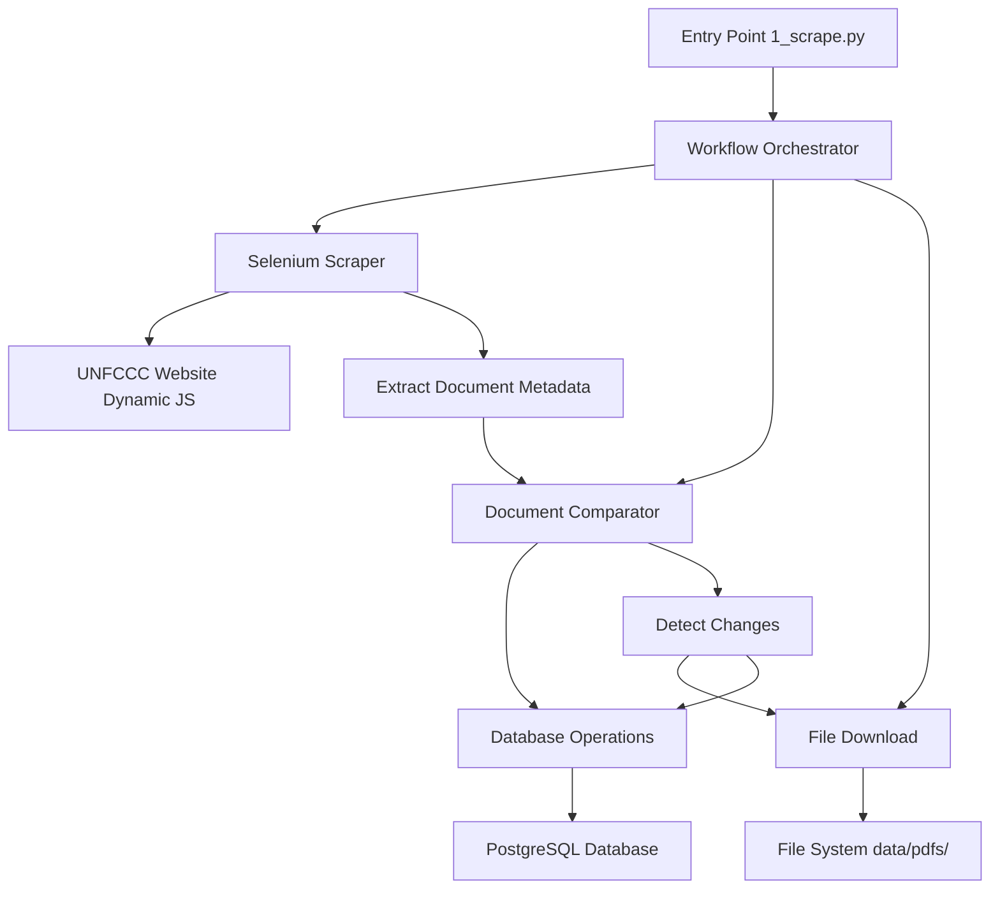
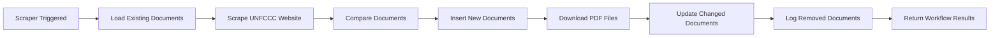
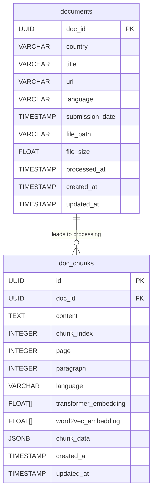

# NDC Document Scraper Documentation

## Table of Contents

- [Overview](#overview)
- [System Architecture](#system-architecture)
- [Core Functions](#core-functions)
- [Processing Workflow](#processing-workflow)
- [Error Handling & Resilience](#error-handling--resilience)
- [Database Integration](#database-integration)
- [Performance & Optimization](#performance--optimization)
- [Usage Examples](#usage-examples)
- [Configuration](#configuration)
- [Dependencies](#dependencies)

---

## Overview

The scrape module automatically discovers, downloads, and tracks changes to climate policy documents from the UNFCCC website. This focused web crawler maintains an up-to-date database of NDC documents with automatic change detection and file caching.

**Core Purpose:** Maintain an up-to-date database of NDC documents with automatic change detection and file caching.

**Entry Point:**
```bash
python 1_scrape.py
```

### Key Features

- **Lightweight Entry Point**: 37-line orchestrator with minimal business logic
- **7-Step Workflow**: Clear sequential processing with comprehensive logging
- **Multi-Strategy Validation**: Content-type checking and file format validation
- **Automatic Downloads**: Immediate caching of discovered documents
- **Change Detection**: Precise tracking of new/updated/removed documents
- **Conservative Error Handling**: Data safety prioritized over automation

### Design Principles

**Selenium over requests:** The UNFCCC site uses dynamic JavaScript tables that simple HTTP requests cannot access.

**Immediate downloads:** Documents sometimes disappear from government websites, so we cache them when discovered.

**PDF/DOC/DOCX only:** These are the only formats reliably processable downstream. Other formats are logged but skipped.

---

## System Architecture

### Module Structure

```
group4py/src/scrape/
├── __init__.py           # Public API exports
├── workflow.py           # 7-step orchestration layer
├── selenium.py           # Web scraping with browser automation
├── download.py           # Document file downloads
├── db_operations.py      # Database CRUD operations
├── comparator.py         # Document change detection
├── config.py             # Runtime settings
└── exceptions.py         # Custom error hierarchy
```

### Data Flow



**Process Flow:** `workflow.py` coordinates all operations. `selenium.py` extracts document metadata from the dynamic UNFCCC website. `comparator.py` detects changes between existing and newly scraped documents. `db_operations.py` manages database updates. `download.py` fetches and validates document files.

---

## Core Functions

### Function Overview

| Function Name | File | Responsibility |
|---------------|------|----------------|
| `main()` | 1_scrape.py | Entry point orchestrator |
| `run_scraping_workflow()` | workflow.py | 7-step workflow coordination |
| `scrape_ndc_documents()` | selenium.py | Extract metadata from UNFCCC |
| `compare_documents()` | comparator.py | Detect document changes |
| `retrieve_existing_documents()` | db_operations.py | Load existing database records |
| `insert_new_documents()` | db_operations.py | Add new documents to database |
| `update_existing_documents()` | db_operations.py | Update changed documents |
| `download_pdf()` | download.py | Download and validate document files |

### Entry Point Function

#### `main() -> Dict[str, Any]`

**Purpose:** Minimal orchestrator that delegates all business logic to the scrape module.

```python
@Logger.log(log_file=project_root / "logs/scrape.log", log_level="INFO")
def main():
    """Execute the NDC document scraping workflow."""
    try:
        result = run_scraping_workflow()
        return result
    except Exception as e:
        print(f"Scraping workflow failed: {str(e)}")
        raise
```

**Design Rationale:** All complex logic remains in the `scrape` module, keeping the entry point clean and testable while delegating specialized operations to dedicated modules.

### Workflow Orchestration

#### `run_scraping_workflow(config: Optional[ScrapingConfig] = None) -> Dict[str, Any]`

**Purpose:** Executes the complete 7-step NDC document scraping workflow.

**Parameters:**
- `config` (Optional[ScrapingConfig]): Configuration for scraping operations. Defaults to `DEFAULT_CONFIG`.

**Returns:**
- `Dict[str, Any]`: Comprehensive workflow results and statistics

**The 7-Step Process:**
1. **Load existing documents** from database
2. **Scrape fresh metadata** from UNFCCC website  
3. **Compare** to find new/updated/removed documents
4. **Insert** new documents to database
5. **Download** new document files (PDF/DOC/DOCX only)
6. **Update** changed documents in database
7. **Log** removed documents (but don't delete them)

### Database Operations

#### `retrieve_existing_documents() -> List[NDCDocumentModel]`

Retrieves all existing documents from the database for comparison.

#### `insert_new_documents(new_docs: List[NDCDocumentBase]) -> int`

Inserts newly discovered documents into the database.

#### `update_existing_documents(updated_docs: List[NDCDocumentBase]) -> int`

Updates existing documents with changed metadata.

### Document Comparison

#### `compare_documents(existing_docs, new_docs) -> Dict[str, List]`

**Purpose:** Compares existing and scraped documents to detect changes.

**Returns:**
- `new`: Documents found on website but not in database
- `updated`: Documents with changed metadata
- `removed`: Documents in database but not on website

### Web Scraping

#### `scrape_ndc_documents(headless: bool = True, timeout: int = 30) -> List[NDCDocumentModel]`

**Purpose:** Extracts document metadata from the UNFCCC website using Selenium.

**Process:**
1. Initialize Chrome WebDriver with anti-detection measures
2. Navigate to UNFCCC NDC registry
3. Extract table rows containing document information
4. Parse metadata (country, title, URL, submission date)
5. Return structured document objects

### Document Download

#### `download_pdf(url: str, output_dir: Optional[str] = None, **kwargs) -> str`

**Purpose:** Downloads documents with comprehensive validation and error handling.

**Validation Strategy:**
1. Check file extension in URL
2. Verify HTTP Content-Type header  
3. Download and validate file isn't empty
4. For PDFs, check file starts with PDF magic bytes

**Filename Convention:**
```
{country}_{language}_{date}.pdf
```
Examples: `Rwanda_en_20220601.pdf`, `France_fr_20231215.pdf`

**Rationale:** Predictable filenames facilitate downstream processing. Date tracking enables document version management.

---

## Processing Workflow



### Step-by-Step Execution

```python
def run_scraping_workflow(config: Optional[ScrapingConfig] = None) -> Dict[str, Any]:
    # Step 1: Retrieve existing documents from database
    existing_docs = retrieve_existing_documents()
    
    # Step 2: Scrape fresh documents from website
    new_docs = scrape_ndc_documents(headless=config.headless, timeout=config.timeout)
    
    # Step 3: Compare documents to find changes
    changes = compare_documents(existing_docs, new_docs)
    
    # Step 4: Process new documents
    inserted_count = insert_new_documents(changes['new'])
    
    # Step 5: Download new documents
    downloaded_count, failed_downloads = _download_new_documents(changes['new'], config)
    
    # Step 6: Process updated documents
    updated_count = update_existing_documents(changes['updated'])
    
    # Step 7: Log removed documents (don't delete)
    _log_removed_documents(changes['removed'], config.log_removed_limit)
```

### Content Validation Strategy

Government websites frequently have broken links and misconfigured servers. Multiple validation layers prevent corrupted data entry.

**Multi-Level Validation:**
- URL structure validation
- HTTP Content-Type verification
- File size validation
- Format-specific magic byte checking
- Complete download verification

---

## Error Handling & Resilience

### Exception Hierarchy

```
ScrapeError (base)
├── DatabaseConnectionError
├── DocumentScrapingError  
├── DocumentValidationError
├── WorkflowError
└── DocumentDownloadError
    ├── UnsupportedFormatError
    └── FileValidationError
```

### Recovery Strategies

#### Selenium Failures
- **Page won't load:** Retry up to 3 times with 5-second delays
- **Elements not found:** Log warning, continue with partial data
- **Browser crashes:** Clean shutdown, raise clear error

#### Download Failures  
- **Network timeout:** Retry with exponential backoff
- **Invalid format:** Log error, skip file (but keep metadata)
- **Partial download:** Delete incomplete file, mark as failed

#### Database Issues
- **Connection lost:** Raise clear error (don't continue with stale data)
- **Insert conflict:** Log warning, continue (probably duplicate detection)
- **Transaction failure:** Rollback, preserve original state

### Error Handling Philosophy

**Conservative approach:** Data safety takes priority over automation. The system fails explicitly rather than risk database corruption with invalid data.

---

## Database Integration

### Storage Schema



### UUID Strategy

**Deterministic Document IDs:**
```python
doc_uuid = uuid.uuid5(uuid.NAMESPACE_URL, url)
# Same document URL always gets same UUID across runs
```

**Rationale:** Deterministic UUIDs ensure consistent document identification across multiple scraping runs, preventing duplicates and enabling reliable change tracking.

---

## Performance & Optimization

### Runtime Characteristics

**Typical Performance:**
- **Runtime:** 2-5 minutes for full workflow  
- **Memory usage:** ~100MB peak (mostly browser overhead)  
- **Network:** ~10-50 MB depending on document downloads  
- **Database:** Light load (mostly reads, few writes)

**Bottlenecks:** Browser automation (slow), UNFCCC website (unreliable), document downloads (variable)

### Optimization Strategies

#### Browser Optimization
- Headless mode by default (faster, works on servers)
- Connection reuse and session management
- Proper cleanup of WebDriver resources

#### Download Optimization
- Parallel downloads with rate limiting
- Streaming downloads for large files
- Efficient retry logic with exponential backoff

---

## Usage Examples

### Basic Usage

```bash
# Standard workflow execution
python 1_scrape.py
```

### Programmatic Usage

```python
from group4py.src.scrape import run_scraping_workflow, ScrapingConfig

# Use default configuration
result = run_scraping_workflow()

# Custom configuration
config = ScrapingConfig(
    headless=False,  # Show browser for debugging
    timeout=60,      # Longer timeout for slow connections
    max_retries=5    # More retries for reliability
)
result = run_scraping_workflow(config)

# Analyze results
print(f"Found {result['new_count']} new documents")
print(f"Downloaded {result['downloaded_count']} documents")
print(f"Failed to download {result['failed_downloads']} documents")
```

### Result Interpretation

```python
{
    'existing_count': 1247,        # Documents already in database  
    'scraped_count': 1251,         # Documents found on website
    'new_count': 4,                # New documents discovered
    'updated_count': 2,            # Documents with changed metadata
    'removed_count': 0,            # Documents no longer on website
    'inserted_count': 4,           # Successfully saved to database
    'downloaded_count': 3,         # Files successfully downloaded
    'failed_downloads': 1,         # Download failures
    'updated_actual_count': 2,     # Metadata updates applied
    'success': True                # Overall workflow status
}
```

**Reading the results:** `new_count` vs `inserted_count` shows database failures. `new_count` vs `downloaded_count` shows file download issues.

---

## Configuration

### ScrapingConfig Parameters

```python
@dataclass
class ScrapingConfig:
    # Browser settings
    headless: bool = True          # No GUI by default (faster, works on servers)
    timeout: int = 30              # 30-second page load limit (UNFCCC can be slow)
    max_retries: int = 3           # Retry failed operations (network issues are common)
    retry_delay: int = 5           # Delay between retries
    
    # Download settings  
    force_download: bool = False   # Skip if content-type doesn't match extension
    
    # Error handling
    abort_on_no_docs: bool = True  # Fail if scraping returns nothing (likely a problem)
    process_removed_docs: bool = False  # Log but don't delete (data preservation)
    log_removed_limit: int = 5     # Don't spam logs with huge removal lists
```

### Configuration Rationale

**Parameter Selection:** 
- 30 seconds handles slow government websites
- 3 retries catch transient network issues without excessive delays  
- Conservative defaults prioritize data safety over automation
- Content-type validation prevents HTML error pages masquerading as PDFs

### Environment Variables

- `DATABASE_URL`: PostgreSQL connection string
- `LOG_LEVEL`: Logging verbosity (INFO, DEBUG, WARNING)

---

## Dependencies

**Core Libraries:**
- `selenium`: Browser automation for dynamic content
- `webdriver-manager`: Automatic ChromeDriver management
- `requests`: HTTP client for file downloads
- `sqlalchemy`: Database ORM and connection management
- `pathlib`: Modern file path handling

**Internal Modules:**
- `group4py.src.scrape.workflow`: Orchestration logic
- `group4py.src.scrape.selenium`: Web scraping implementation
- `group4py.src.scrape.download`: File download and validation
- `group4py.src.scrape.db_operations`: Database interactions
- `databases.models`: SQLAlchemy ORM definitions

### Common Issues & Solutions

**"No documents scraped"** → Usually means UNFCCC website changed structure or is down  
**"Downloads failing"** → Check if URLs are valid and files still exist  
**"Browser won't start"** → Install Chrome/Chromium and update chromedriver  
**"Database connection failed"** → Verify DATABASE_URL environment variable

### Monitoring & Logging

Health monitoring log patterns:
- `Found X existing documents` (startup validation)
- `Scraped X documents from website` (scraping success)  
- `Successfully downloaded X/Y new documents` (download summary)
- `NDC document scraping workflow completed successfully!` (everything worked)

Missing any of these patterns suggests a problem at that stage.

### Extension Points

**Adding new document sources:** Implement the same interface as `selenium.py`:
```python
def scrape_documents(headless: bool, timeout: int) -> List[NDCDocumentModel]:
    # Your scraping logic here
    pass
```

**Custom download logic:** Replace `download.py` while maintaining the same function signature.

**Custom change detection:** Modify `comparator.py` - it contains pure business logic with no side effects.

The modular design facilitates component replacement and extension. 