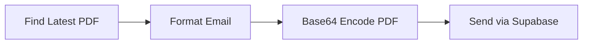

# Send Email Module Documentation

---

## 📘 Table of Contents

1. [Overview](#overview)
2. [Core Functions](#core-functions)
3. [Usage](#usage)
4. [Environment Setup](#environment-setup)

---

## Overview

The `7_send_email.py` script sends PDF factsheets via email using Supabase Edge Functions. It automatically finds the latest PDF in your outputs folder, formats a professional email with HTML content, and delivers it to configured recipients.

This is a straightforward utility—no complex logic, just PDF → email delivery.



---

## Core Functions

| Function | Role | Key Logic |
|----------|------|-----------|
| `find_latest_pdf_factsheet()` | Locates newest PDF | Searches `outputs/factsheets/`, sorts by modification time |
| `send_factsheet_email()` | Assembles email | Extracts country/date from filename, builds HTML content |
| `send_email_with_attachments()` | Handles delivery | Base64 encodes PDF, calls Supabase Edge Function |
| `main()` | CLI entry point | Parses arguments, orchestrates the flow |

### Email Content Logic
The script extracts country names and dates from PDF filenames (e.g., `Afghanistan_climate_policy_factsheet_20250528_193204.pdf`) to personalize the email subject and content with update notifications.

---

## Usage

### Basic Commands
```bash
# Send latest PDF to default recipients
python 7_send_email.py

# Send to specific recipient
python 7_send_email.py --to user@example.com

# Send specific PDF file  
python 7_send_email.py --pdf-path outputs/factsheets/report.pdf

# Test without sending
python 7_send_email.py --dry-run
```

### CLI Arguments
- `--to` / `-t`: Additional recipient emails (comma-separated)
- `--pdf-path` / `-p`: Specific PDF file path (defaults to latest)
- `--from` / `-f`: Sender email (overrides .env default)
- `--dry-run` / `-d`: Show what would be sent without sending
- `--env-file`: Custom .env file path (defaults to `.env`)

---

## Environment Setup

Required `.env` variables:

```bash
# Required
SUPABASE_URL=https://your-project.supabase.co
SUPABASE_ANON_KEY=your-anon-key

# Optional (with defaults)
DEFAULT_EMAIL_SENDER=noreply@yourapp.com
DEFAULT_EMAIL_RECIPIENT=team@yourorg.com,analyst@yourorg.com
EDGE_FUNCTION_NAME=send-email
```

### Default Recipients
If no `--to` is specified, the script uses `DEFAULT_EMAIL_RECIPIENT` from your `.env` file. The default includes the project team emails.

### PDF Discovery
The script searches these locations in order:
1. `outputs/factsheets/` (primary)
2. `factsheets/` (fallback)
3. `output/factsheets/` (fallback)
4. `data/factsheets/` (fallback)

It picks the most recently modified PDF file found.

---

**That's it.** The script logs everything to `logs/send_email.log` and exits with appropriate status codes for automation. 