# Climate Policy RAG Pipeline: Visual Workflow Guide

## System Overview

**Key Points:**
- **7-stage automated pipeline** from web scraping to email delivery
- **Vector-powered search** enables semantic understanding of climate policies
- **Professional output** generates client-ready fact sheets with citations

---

## 1. Document Scraping Architecture

**Key Points:**
- **Selenium browser automation** handles dynamic JavaScript content
- **Change detection** only downloads new or updated documents
- **Immediate caching** prevents government link rot
- **Audit trail** tracks all document changes over time

---

## 2. Document Processing Flow

**Key Points:**
- **Triple-fallback extraction** ensures text recovery from any PDF type
- **Semantic chunking** preserves meaning with sentence boundaries
- **Context overlap** maintains coherence between adjacent chunks
- **Metadata tracking** preserves document structure and page references

---

## 3. Embedding Architecture

```mermaid
graph TB
    subgraph "Layer 1: Parallel Embedding Generation"
        A[📝 Text Chunks] --> B[🤖 Transformer Models]
        A --> C[📊 Word2Vec Model]
        B --> D[Semantic Embeddings]
        C --> E[Domain Embeddings]
    end
    
    subgraph "Layer 2: Relationship Discovery"
        D --> F[🕸️ HopRAG Processor]
        E --> F
        F --> G[Logical Relationships]
    end
    
    subgraph "Storage Layer"
        D --> H[(Vector Database)]
        E --> H
        G --> I[(Relationship Graph)]
    end
    
    style A fill:#fff3e0,stroke:#ef6c00
    style F fill:#f3e5f5,stroke:#8e24aa
    style H fill:#e8f5e8,stroke:#43a047
    style I fill:#e1f5fe,stroke:#039be5
```

**Key Points:**
- **Dual embedding strategy** combines deep learning with domain expertise
- **Global Word2Vec training** ensures consistent climate terminology
- **HopRAG relationships** enable multi-hop reasoning between concepts
- **Three vector types** stored for comprehensive search capabilities

---

## 4. Multi-Modal Retrieval System

```mermaid
graph LR
    A[🔍 Query] --> B[Vector Embedding]
    A --> C[Pattern Extraction]
    
    B --> D[Transformer Search]
    B --> E[Word2Vec Search]
    C --> F[Regex Matching]
    C --> G[Fuzzy Matching]
    
    D --> H[🎯 Combined Scoring]
    E --> H
    F --> H
    G --> H
    
    H --> I[📊 Ranked Results]
    H --> J[🕸️ HopRAG Traversal]
    J --> K[🔗 Graph Results]
    
    style A fill:#fff3e0,stroke:#f57c00
    style H fill:#f3e5f5,stroke:#8e24aa
    style I fill:#e8f5e8,stroke:#43a047
    style K fill:#e1f5fe,stroke:#039be5
```

**Key Points:**
- **4-method evaluation** balances semantic and pattern-based matching
- **Weighted scoring** optimized for climate policy document characteristics
- **Dual retrieval paths** provide both similarity and graph-based results
- **Configurable thresholds** ensure quality control over retrieved content

---

## 5. LLM Processing Pipeline

```mermaid
graph TD
    A[📊 Standard Retrieval] --> C[🔀 Context Merger]
    B[🕸️ HopRAG Retrieval] --> C
    
    C --> D[📋 Structured Prompting]
    D --> E[🤖 LLM Processing]
    E --> F[📝 JSON Response]
    
    F --> G{Citation Validation}
    G -->|✅ Valid| H[✨ Structured Answer]
    G -->|❌ Invalid| I[🔄 Retry with Feedback]
    I --> E
    
    H --> J[📈 Confidence Scoring]
    J --> K[💾 Final Storage]
    
    style C fill:#fff3e0,stroke:#f57c00
    style E fill:#f3e5f5,stroke:#8e24aa
    style H fill:#e8f5e8,stroke:#43a047
    style K fill:#e1f5fe,stroke:#039be5
```

**Key Points:**
- **Context merging** combines both retrieval methods for comprehensive input
- **Guided JSON generation** enforces consistent response structure
- **Citation validation** ensures all claims are traceable to source chunks
- **Confidence scoring** evaluates response quality and reliability

---

## 6. PDF Document Assembly

```mermaid
graph TD
    A[📁 JSON Files] --> B[🔍 Content Discovery]
    B --> C[📊 Data Extraction]
    
    C --> D[Document Assembly]
    
    subgraph "PDF Components"
        D --> E[🏷️ Title Page]
        D --> F[📋 Metadata Table]
        D --> G[❓ Q&A Sections]
        D --> H[📚 Citations]
    end
    
    E --> I[🎨 Professional Styling]
    F --> I
    G --> I
    H --> I
    
    I --> J[📄 PDF Generation]
    J --> K[📁 Timestamped Output]
    
    style A fill:#fff3e0,stroke:#f57c00
    style D fill:#f3e5f5,stroke:#8e24aa
    style I fill:#e8f5e8,stroke:#43a047
    style K fill:#e1f5fe,stroke:#039be5
```

**Key Points:**
- **Automated file discovery** finds latest LLM processing results
- **Structured assembly** creates professional document layout
- **Citation organization** groups sources by relevance and country
- **Client-ready formatting** produces stakeholder-ready fact sheets

---

## 7. Email Delivery System

```mermaid
graph LR
    A[📁 Output Directory] -->|scan| B[📄 Latest PDF]
    B -->|extract| C[🏷️ Metadata]
    C -->|generate| D[✉️ Email Content]
    
    D --> E[🚀 Supabase Delivery]
    B --> E
    
    E --> F{Delivery Status}
    F -->|✅ Success| G[📋 Delivery Log]
    F -->|❌ Failure| H[🔄 Error Handling]
    H --> I[📧 Retry Queue]
    
    style A fill:#fff3e0,stroke:#f57c00
    style E fill:#f3e5f5,stroke:#8e24aa
    style G fill:#e8f5e8,stroke:#43a047
    style I fill:#ffebee,stroke:#c62828
```

**Key Points:**
- **Smart file detection** automatically finds most recent fact sheet
- **Dynamic content generation** personalizes emails with country/date info
- **Reliable delivery** uses Supabase Edge Functions with attachment support
- **Error recovery** includes retry logic and comprehensive logging

---

## Data Architecture Overview

**Key Points:**
- **PostgreSQL + pgvector** provides both structured data and vector search
- **Three embedding types** enable different retrieval strategies
- **Graph relationships** support multi-hop reasoning and knowledge discovery
- **ACID compliance** ensures data integrity throughout the pipeline

---

## Performance Characteristics

**Key Points:**
- **Full pipeline**: 30-60 minutes for complete document refresh
- **Incremental updates**: 5-15 minutes for new documents only
- **Memory efficient**: ~2GB peak usage during embedding generation
- **Scalable processing**: Configurable parallelism and batch sizes 