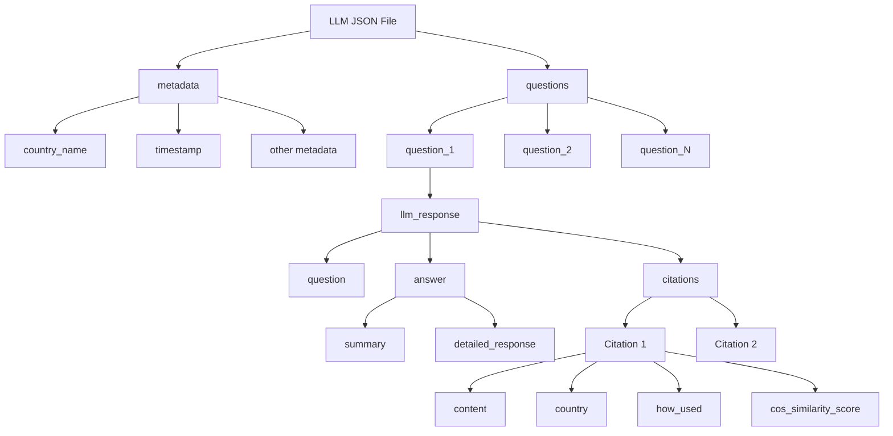
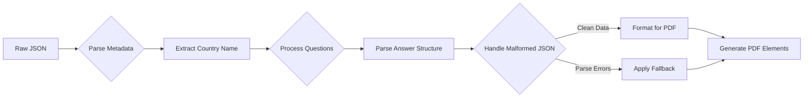
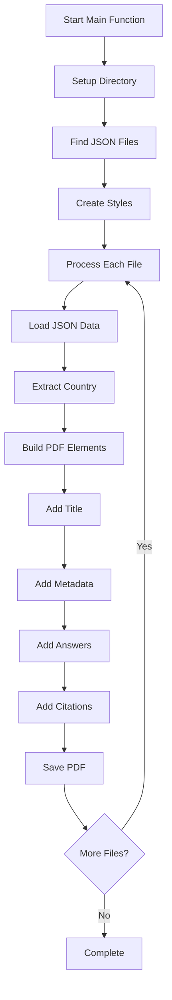

# Output Module Documentation

---

## 📘 Overview

The `6_output.py` script converts structured LLM response JSON files into professional PDF fact sheets. It's the final stage of our RAG pipeline—taking analyzed climate policy data and producing client-ready reports.

**What it does**: Finds JSON files in `data/llm/`, extracts country-specific content, and generates styled PDFs with metadata tables, Q&A sections, and source citations.

---

## 🔁 How It Works

### Key Functions

| Function | Purpose | Input/Output |
|----------|---------|--------------|
| `get_available_llm_files()` | Discovers JSON files | Returns list of file paths |
| `load_llm_response_data()` | Parses JSON & extracts country | JSON path → country name + data |
| `create_pdf_style()` | Defines ReportLab styles | None → StyleSheet with colors |
| `generate_pdf_report()` | Assembles final PDF | Data + styles → PDF file |

---

## Input Format

### Expected JSON Structure

The module expects JSON files in the `data/llm/` directory with this structure:



### JSON Processing Flow



### Why This Input Structure?

The structure accommodates the output from our LLM analysis stage while being flexible enough to handle malformed JSON strings within the data. The metadata extraction allows for country-specific report generation, while the nested question structure supports multi-question fact sheets.

**Error Handling**: The script handles malformed JSON strings within the data structure—common with LLM outputs—by attempting multiple parsing strategies before falling back to safe defaults.

---

## PDF Generation Pipeline



### Processing Modules


### Element Generation Order

1. **Title Section**: Country-specific header with styled title
2. **Metadata Table**: Summary information (question count, citations, timestamp)
3. **Answer Sections**: Each question processed with summary/detailed breakdown
4. **Citations Section**: Grouped by country with relevance scores

This order ensures logical document flow while allowing for flexible content based on available data.

---

## 🚀 How to Use It

### Basic Usage

```bash
python entrypoints/6_output.py
```

This processes all JSON files in `data/llm/` and generates corresponding PDFs in `outputs/factsheets/`.

### Output Format

**Filename**: `{Country}_climate_policy_factsheet_{timestamp}.pdf`

**Example**: `Germany_climate_policy_factsheet_20241201_143022.pdf`

### PDF Contents

Each report contains:
- **Title**: Country-specific header
- **Metadata Table**: Question count, citations, generation timestamp  
- **Q&A Sections**: Structured answers with summaries and detailed analysis
- **Citations**: Grouped by country with relevance scores

### Expected Output

```
[6_OUTPUT] Starting PDF generation from LLM response files...
[6_OUTPUT] Found 3 LLM response files
[6_OUTPUT] Processing: germany_responses.json
[6_OUTPUT] Generating PDF report for Germany...
[6_OUTPUT] PDF report generated: Germany_climate_policy_factsheet_20241201_143022.pdf
```

**Integration**: Returns the output directory path for use in automated pipelines.

---

That's it. The script handles the rest—styling, error recovery, and file management—automatically. 
