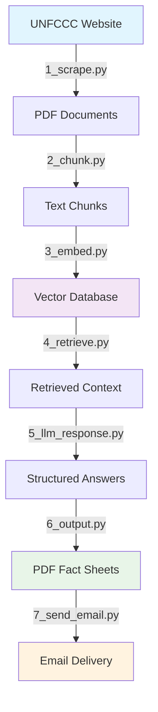
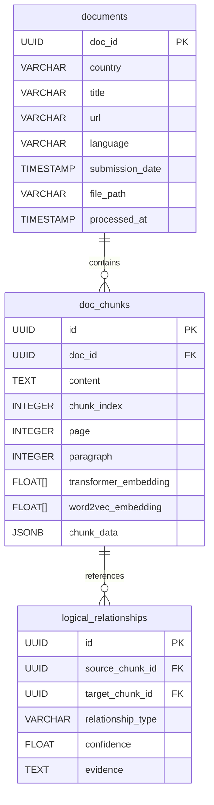

# Climate Policy RAG Pipeline: Complete System Workflow

## Executive Overview

This RAG (Retrieval-Augmented Generation) system automatically processes climate policy documents from the UNFCCC website into structured fact sheets. The pipeline transforms raw PDF documents into searchable knowledge, then generates country-specific policy summaries with verified citations.

**Core Pipeline**: Web Scraping → Document Processing → Vector Embeddings → Multi-Modal Retrieval → LLM Analysis → PDF Generation → Email Delivery

---

## System Architecture



**Data Flow Summary:**
- **Input**: Dynamic UNFCCC website with climate policy documents
- **Processing**: 7-stage pipeline with PostgreSQL storage and vector search
- **Output**: Professional PDF fact sheets delivered via email

---

## Pipeline Stages

### 1. Document Scraping (`1_scrape.py`)

**Purpose**: Maintain up-to-date database of NDC documents from UNFCCC website

**Why It Matters**: Government websites change frequently. Automated scraping with change detection ensures we always have current policy documents without manual intervention.

**Process Flow**:
1. **Browser Automation**: Selenium navigates dynamic JavaScript tables on UNFCCC site
2. **Change Detection**: Compares scraped metadata against existing database records  
3. **Document Download**: Immediately caches PDF/DOC/DOCX files to prevent link rot
4. **Database Updates**: Tracks new, updated, and removed documents with audit trail

**Key Output**: 
- PDF files in `data/pdfs/` directory
- Document metadata in PostgreSQL `documents` table
- Processing logs showing scraping results

**Technical Decisions**:
- **Selenium over HTTP**: UNFCCC uses dynamic content that requires browser rendering
- **Immediate downloads**: Government links often break; cache when discovered
- **Conservative validation**: Multiple content-type checks prevent corrupted downloads

### 2. Document Chunking (`2_chunk.py`)

**Purpose**: Transform PDF documents into semantically coherent text segments

**Why It Matters**: LLMs have token limits and perform better with focused context. Proper chunking preserves meaning while enabling precise retrieval.

**Process Flow**:
1. **Multi-Strategy Extraction**: Fast → Auto → OCR fallback for reliable text extraction
2. **Sentence-Based Segmentation**: 512-character chunks with 2-sentence overlap for context
3. **Content Cleaning**: Removes OCR artifacts, standardizes formatting, filters gibberish
4. **Metadata Preservation**: Tracks page numbers, paragraphs, and document context

**Key Output**:
- Text chunks in PostgreSQL `doc_chunks` table
- Preserved document structure and metadata
- Processing status tracking per document

**Technical Decisions**:
- **Multiple extraction strategies**: Handles both text-based and image-based PDFs
- **Sentence boundaries**: Preserves semantic meaning better than arbitrary splits
- **Overlap strategy**: Ensures context isn't lost at chunk boundaries

### 3. Vector Embedding (`3_embed.py`)

**Purpose**: Convert text chunks into numerical vectors for semantic search and relationship discovery

**Why It Matters**: Pure keyword search misses semantic relationships. Vector embeddings enable finding conceptually similar content even with different terminology.

**Process Flow**:
1. **Global Vocabulary Training**: Single Word2Vec model trained on all documents for consistency
2. **Dual Embedding Strategy**: 
   - Transformer models (DistilRoBERTa/multilingual) for semantic understanding
   - Word2Vec for domain-specific climate terminology relationships
3. **HopRAG Graph Building**: Creates logical relationships between chunks for multi-hop reasoning
4. **Database Storage**: Updates chunks with both embedding vectors

**Key Output**:
- Transformer and Word2Vec embeddings in `doc_chunks` table
- Logical relationships in `logical_relationships` table
- Trained Word2Vec model cached for consistency

**Technical Decisions**:
- **Dual embeddings**: Combines deep contextual understanding with domain expertise
- **Global training**: Ensures consistent vocabulary across all documents
- **Graph relationships**: Enables discovering connections between related policy concepts

### 4. Multi-Modal Retrieval (`4_retrieve.py`)

**Purpose**: Find most relevant chunks for specific climate policy questions using multiple evaluation methods

**Why It Matters**: Climate documents require both semantic understanding and pattern recognition. Pure vector similarity misses specific targets and dates that follow structured patterns.

**Process Flow**:
1. **Query Embedding**: Generates both transformer and Word2Vec vectors for input questions
2. **Dual Retrieval Strategy**:
   - **Standard**: Vector similarity across all chunks with multi-modal scoring
   - **HopRAG**: Graph traversal through logical relationships for multi-hop reasoning
3. **4-Method Evaluation**:
   - Transformer similarity (25%): Semantic understanding
   - Word2Vec similarity (20%): Domain-specific relationships  
   - Regex patterns (30%): Climate targets, dates, specific terminology
   - Fuzzy matching (25%): Contextual pattern recognition
4. **Ranked Results**: Combined scoring with configurable thresholds

**Key Output**:
- JSON files with scored chunks per question and country
- Separate files for standard (`data/retrieve/`) and HopRAG (`data/retrieve_hop/`) results
- Metadata including confidence scores and retrieval methods

**Technical Decisions**:
- **Multi-modal scoring**: Balances semantic and pattern-based matching for climate content
- **Weighted combination**: Optimized ratios based on climate document analysis
- **Dual retrieval paths**: Standard similarity + graph relationships for comprehensive coverage

### 5. LLM Response Generation (`5_llm_response.py`)

**Purpose**: Transform retrieved chunks into structured, validated answers with proper citations

**Why It Matters**: Raw chunks are fragmented and hard to interpret. LLM processing synthesizes information while maintaining traceability through citation validation.

**Process Flow**:
1. **Data Merging**: Combines standard and HopRAG retrieval results for comprehensive context
2. **Context Formatting**: Prepares chunk data with IDs and metadata for LLM processing
3. **Guided JSON Generation**: Uses structured prompts to ensure consistent response format
4. **Citation Validation**: Verifies all references exist in original chunks
5. **Confidence Scoring**: Evaluates response quality based on source material and coherence

**Key Output**:
- Structured JSON responses in `data/llm/` directory
- Validated citations linking answers to source chunks
- Confidence classifications and metadata tracking

**Technical Decisions**:
- **Merge strategy**: Combines both retrieval methods for richer context
- **Guided JSON**: Enforces response structure while maintaining flexibility
- **Citation validation**: Ensures all claims are traceable to source material

### 6. PDF Generation (`6_output.py`)

**Purpose**: Convert structured LLM responses into professional fact sheet documents

**Why It Matters**: JSON data isn't client-ready. Professional PDFs provide accessible summaries that stakeholders can review, share, and reference.

**Process Flow**:
1. **File Discovery**: Locates JSON files from LLM processing stage
2. **Content Extraction**: Parses structured responses and metadata
3. **Professional Styling**: Applies consistent formatting, colors, and layout
4. **Document Assembly**: Creates title, metadata table, Q&A sections, and citations
5. **PDF Generation**: Produces timestamped files with country-specific content

**Key Output**:
- Professional PDF fact sheets in `outputs/factsheets/`
- Timestamped filenames for version tracking
- Structured layout with metadata and citations

**Technical Decisions**:
- **Country-specific generation**: Each country gets dedicated fact sheet
- **Citation grouping**: Sources organized by relevance and country
- **Professional styling**: Client-ready formatting for stakeholder distribution

### 7. Email Delivery (`7_send_email.py`)

**Purpose**: Automatically deliver generated fact sheets to configured recipients

**Why It Matters**: Manual distribution is error-prone and slow. Automated delivery ensures stakeholders receive updated analysis immediately after generation.

**Process Flow**:
1. **File Discovery**: Finds latest PDF fact sheet in outputs directory
2. **Content Personalization**: Extracts country and date info from filename
3. **Email Assembly**: Creates HTML email with PDF attachment
4. **Delivery**: Sends via Supabase Edge Functions with error handling

**Key Output**:
- Email delivery with PDF attachments
- Delivery logs and status confirmation
- Configurable recipient lists

**Technical Decisions**:
- **Latest file detection**: Automatically finds most recent output
- **Supabase integration**: Reliable email delivery with attachment support
- **Flexible recipients**: Supports both default and custom recipient lists

---

## Data Flow & Storage

### Database Schema Overview



### File System Organization

```
project/
├── data/
│   ├── pdfs/           # Downloaded documents (Stage 1)
│   ├── retrieve/       # Standard retrieval results (Stage 4)
│   ├── retrieve_hop/   # HopRAG retrieval results (Stage 4)  
│   └── llm/           # LLM processed responses (Stage 5)
├── outputs/
│   └── factsheets/    # Generated PDF reports (Stage 6)
├── local_models/      # Cached Word2Vec models (Stage 3)
└── logs/              # Processing logs (All stages)
```

---

## Key Technical Decisions

### Why PostgreSQL + pgvector?
Climate policy analysis requires both structured data management and high-dimensional vector operations. PostgreSQL with pgvector extension provides ACID compliance, complex queries, and efficient similarity search in a single system.

### Why Dual Embedding Strategy?
Transformer models excel at semantic understanding but may miss domain-specific climate terminology relationships. Word2Vec trained on the full corpus captures these specialized patterns. Combined, they provide comprehensive coverage.

### Why Multi-Modal Retrieval Scoring?
Climate documents contain both semantic content and structured patterns (targets, dates, percentages). Pure vector similarity misses regex-detectable patterns, while pure keyword matching misses semantic relationships. The weighted combination optimizes for climate policy content.

### Why Graph Relationships (HopRAG)?
Climate policies often reference related concepts across document sections. Graph traversal discovers these connections that pure similarity search might miss, enabling more comprehensive analysis.

### Why Guided JSON Output?
Structured LLM responses are critical for reliable downstream processing. Guided JSON enforces consistency while fallback parsing maintains compatibility with various API capabilities.

---

## System Characteristics

### Performance Profile
- **Full pipeline runtime**: 30-60 minutes for complete refresh
- **Incremental updates**: 5-15 minutes for new documents only
- **Memory requirements**: ~2GB peak during embedding generation
- **Storage growth**: ~10MB per document processed

### Error Handling Philosophy
**Conservative data safety**: The system prioritizes data integrity over automation. Failed operations are logged and skipped rather than risking corruption. Manual intervention points are clearly identified.

### Scalability Considerations
- **Concurrent processing**: Configurable parallelism in chunking and embedding
- **Incremental updates**: Only processes new/changed documents
- **Database optimization**: Indexed embeddings for fast similarity search
- **Memory management**: Streaming processing and periodic garbage collection

---

## Integration Points

### External Dependencies
- **UNFCCC Website**: Source of climate policy documents
- **LLM API**: Structured response generation (configurable model)
- **Supabase**: Email delivery infrastructure
- **PostgreSQL**: Data storage and vector search

### Configuration Management
- **Environment variables**: API keys, database connections, model settings
- **Configurable parameters**: Retrieval weights, chunk sizes, quality thresholds
- **Logging levels**: Adjustable verbosity for debugging and monitoring

### Monitoring & Health Checks
- **Pipeline status**: Each stage logs success/failure with metrics
- **Data quality**: Validation checks at each transformation stage
- **Performance tracking**: Processing times and resource usage
- **Error aggregation**: Centralized logging for troubleshooting

This pipeline transforms raw climate policy documents into actionable insights through a sophisticated multi-stage process, balancing accuracy, efficiency, and reliability for production climate policy analysis. 