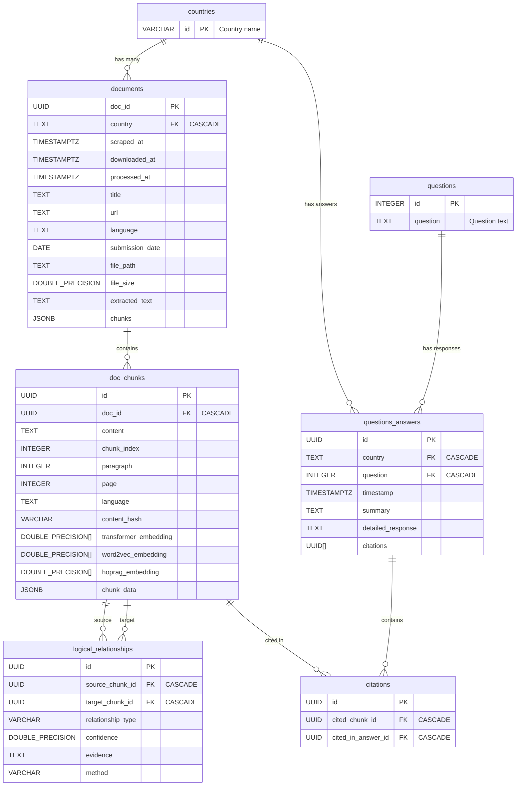

# RAG Database Schema Documentation

## What This Database Does

This database stores climate policy documents (NDCs), breaks them into searchable chunks, and answers specific questions about each country's climate commitments. It's designed for a retrieval-augmented generation (RAG) system that needs to quickly find and cite relevant information.

**Setup:**
```bash
python setup_database.py  # Executes all SQL files in order
```

## Table of Contents

- [What This Database Does](#what-this-database-does)
- [Database Structure](#database-structure)
- [Database Diagram](#database-diagram)
- [The 7 Tables](#the-7-tables)
  - [1. countries](#1-countries)
  - [2. questions](#2-questions)
  - [3. documents](#3-documents)
  - [4. doc_chunks](#4-doc_chunks)
  - [5. logical_relationships](#5-logical_relationships)
  - [6. questions_answers](#6-questions_answers)
  - [7. citations](#7-citations)
- [Data Flow in Practice](#data-flow-in-practice)
- [Cascade Delete Strategy](#cascade-delete-strategy)
- [Performance Considerations](#performance-considerations)
- [Common Queries](#common-queries)

## Database Structure

The schema follows the document processing pipeline: scrape → chunk → embed → analyze → answer.

```
countries (150+ countries) 
    ↓ CASCADE DELETE
documents (PDFs, metadata, processing status)
    ↓ CASCADE DELETE  
doc_chunks (text segments with embeddings)
    ↓ CASCADE DELETE
logical_relationships (how chunks relate to each other)

questions (10 predefined policy questions)
    ↓ CASCADE DELETE
questions_answers (country-specific responses with citations)
    ↓ CASCADE DELETE
citations (links answers to source chunks)
```

**Why this structure?** Each level represents a stage in our pipeline. Cascade deletes ensure if you remove a country, all its documents, chunks, relationships, and answers disappear too—no orphaned data.

## Database Diagram



---

## The 7 Tables

### 1. countries

Primary reference table containing country identifiers.

```sql
CREATE TABLE countries (
    id VARCHAR(255) PRIMARY KEY
);
```

| Column | Type | Description |
|--------|------|-------------|
| id | VARCHAR(255) | Primary key, country name |

**Design choice:** Country name as primary key because it's human-readable and referenced throughout the system. No separate integer IDs because country names are stable identifiers.

**Sample data:** `'Rwanda'`, `'United Kingdom of Great Britain and Northern Ireland'`, `'Côte d''Ivoire'`

### 2. questions

Pre-defined questions for document analysis.

```sql
CREATE TABLE questions (
    id INTEGER PRIMARY KEY,
    question TEXT NOT NULL
);
```

| Column | Type | Description |
|--------|------|-------------|
| id | INTEGER | Primary key |
| question | TEXT | The question text |

**Sample questions:**
- "What does the country promise as their 2030/2035 NDC target?"
- "What policies or strategies does the country propose to meet its targets?"
- "Do they specify what sectors of their economy will be the hardest to reduce emissions in?"

**Why fixed questions?** This isn't a general Q&A system—it's focused on extracting specific policy information consistently across all countries.

### 3. documents

Stores document metadata with link to countries.

```sql
CREATE TABLE documents (
    doc_id UUID PRIMARY KEY,
    country TEXT REFERENCES countries(id) ON DELETE CASCADE,
    
    -- Processing timeline
    scraped_at TIMESTAMPTZ,
    downloaded_at TIMESTAMPTZ, 
    processed_at TIMESTAMPTZ,
    last_download_attempt TIMESTAMPTZ,
    download_error TEXT,
    download_attempts INTEGER,
    
    -- Document metadata
    title TEXT,
    url TEXT,
    language TEXT,
    submission_date DATE,
    file_path TEXT,
    file_size DOUBLE PRECISION,
    
    -- Processed content
    extracted_text TEXT,        -- Full text from PDF
    chunks JSONB,              -- Raw chunk data before database storage
    
    created_at TIMESTAMPTZ,
    updated_at TIMESTAMPTZ
);
```

| Column | Type | Description |
|--------|------|-------------|
| doc_id | UUID | Primary key |
| scraped_at | TIMESTAMPTZ | When document was scraped |
| downloaded_at | TIMESTAMPTZ | When document was downloaded |
| processed_at | TIMESTAMPTZ | When document was processed |
| last_download_attempt | TIMESTAMPTZ | Last time download was attempted |
| download_error | TEXT | Error message if download failed |
| download_attempts | INTEGER | Number of download attempts |
| country | TEXT | Foreign key to countries(id) with CASCADE delete |
| title | TEXT | Document title |
| url | TEXT | Source URL |
| language | TEXT | Document language |
| submission_date | DATE | When document was submitted |
| file_path | TEXT | Path to stored file |
| file_size | DOUBLE PRECISION | File size in bytes |
| extracted_text | TEXT | Plain text extracted from document |
| chunks | JSONB | JSON representation of chunks |
| created_at | TIMESTAMPTZ | Record creation timestamp |
| updated_at | TIMESTAMPTZ | Record update timestamp |

**Key design decisions:**

**Why so many timestamp fields?** NDC documents change over time. We track each processing stage to debug issues and avoid reprocessing successfully handled documents.

**Why store both `extracted_text` and `chunks`?** `extracted_text` preserves the full document for debugging. `chunks` stores the pre-processed JSON before it gets normalized into the `doc_chunks` table.

**Why `download_attempts` and `download_error`?** Government websites are unreliable. We track failures and retry limits to avoid infinite retry loops.

### 4. doc_chunks

Stores segments of documents for efficient retrieval.

```sql
CREATE TABLE doc_chunks (
    id UUID PRIMARY KEY,
    doc_id UUID NOT NULL REFERENCES documents(doc_id) ON DELETE CASCADE,
    
    -- Chunk content and position
    content TEXT NOT NULL,
    chunk_index INTEGER NOT NULL,     -- Position within document
    paragraph INTEGER,                -- Source paragraph number
    page INTEGER,                     -- Source page number
    language TEXT,
    content_hash VARCHAR(64),         -- For deduplication
    
    -- Three types of embeddings
    transformer_embedding DOUBLE PRECISION[],    -- BERT/RoBERTa vectors
    word2vec_embedding DOUBLE PRECISION[],       -- Domain-specific vectors
    hoprag_embedding DOUBLE PRECISION[],         -- Relationship-optimized vectors
    
    chunk_data JSONB,                 -- Additional metadata
    created_at TIMESTAMPTZ,
    updated_at TIMESTAMPTZ
);
```

| Column | Type | Description |
|--------|------|-------------|
| id | UUID | Primary key |
| doc_id | UUID | Foreign key to documents(doc_id) with CASCADE delete |
| content | TEXT | Chunk text content |
| chunk_index | INTEGER | Position within document |
| paragraph | INTEGER | Paragraph number |
| page | INTEGER | Page number in document |
| language | TEXT | Chunk language |
| transformer_embedding | DOUBLE PRECISION[] | Vector embedding from transformer model |
| word2vec_embedding | DOUBLE PRECISION[] | Word2Vec embedding |
| hoprag_embedding | DOUBLE PRECISION[] | HopRAG embedding |
| chunk_data | JSONB | Additional chunk metadata |
| created_at | TIMESTAMPTZ | Record creation timestamp |
| updated_at | TIMESTAMPTZ | Record update timestamp |
| content_hash | VARCHAR(64) | Hash of content for deduplication |

**Why three different embeddings?** Each serves a different purpose:
- **Transformer**: Best for semantic similarity
- **Word2Vec**: Captures domain-specific climate terminology
- **HopRAG**: Optimized for finding logical relationships

**Why `content_hash`?** Climate documents often repeat sections (like standard disclaimers). Hashing helps identify and potentially deduplicate identical content.

**Why `chunk_index` vs `paragraph` vs `page`?** 
- `chunk_index`: Our processing order (0, 1, 2...)
- `paragraph`: Original document structure  
- `page`: Where users can find this text in the PDF

### 5. logical_relationships

Defines semantic relationships between document chunks.

```sql
CREATE TABLE logical_relationships (
    id UUID PRIMARY KEY DEFAULT gen_random_uuid(),
    source_chunk_id UUID NOT NULL REFERENCES doc_chunks(id) ON DELETE CASCADE,
    target_chunk_id UUID NOT NULL REFERENCES doc_chunks(id) ON DELETE CASCADE,
    
    relationship_type VARCHAR(50) NOT NULL CHECK (
        relationship_type IN (
            'SUPPORTS', 'EXPLAINS', 'CONTRADICTS', 
            'FOLLOWS', 'TEMPORAL_FOLLOWS', 'CAUSES'
        )
    ),
    
    confidence DOUBLE PRECISION NOT NULL CHECK (
        confidence >= 0.0 AND confidence <= 1.0
    ),
    
    evidence TEXT,                    -- Why we think this relationship exists
    method VARCHAR(50) DEFAULT 'rule_based',  -- How we detected it
    created_at TIMESTAMP WITH TIME ZONE DEFAULT NOW(),
    
    CHECK (source_chunk_id != target_chunk_id)  -- No self-references
);
```

| Column | Type | Description |
|--------|------|-------------|
| id | UUID | Primary key (auto-generated) |
| source_chunk_id | UUID | Foreign key to doc_chunks(id) with CASCADE delete |
| target_chunk_id | UUID | Foreign key to doc_chunks(id) with CASCADE delete |
| relationship_type | VARCHAR(50) | Type of relationship (SUPPORTS, EXPLAINS, etc.) |
| confidence | DOUBLE PRECISION | Confidence score (0.0-1.0) |
| evidence | TEXT | Supporting evidence for relationship |
| method | VARCHAR(50) | Method used to establish relationship |
| created_at | TIMESTAMPTZ | Record creation timestamp |

**Purpose:** Maps logical connections between document sections (e.g., "Section A supports claim in Section B").

**The 6 relationship types:**
- **SUPPORTS**: Evidence backing up a claim
- **EXPLAINS**: Detailed explanation of a concept  
- **CONTRADICTS**: Conflicting information
- **FOLLOWS**: Logical sequence (A then B)
- **TEMPORAL_FOLLOWS**: Time-based sequence  
- **CAUSES**: Causal relationships

**Why these specific types?** Climate policy documents have predictable logical structures. These six cover the most common patterns we see in NDCs.

**Why `confidence` scores?** Relationship detection isn't perfect. Confidence scores let us filter out weak connections and focus on high-confidence relationships.

### 6. questions_answers

Stores answers to questions about specific countries.

```sql
CREATE TABLE questions_answers (
    id UUID PRIMARY KEY DEFAULT gen_random_uuid(),
    country TEXT NOT NULL REFERENCES countries(id) ON DELETE CASCADE,
    question INTEGER NOT NULL REFERENCES questions(id) ON DELETE CASCADE,
    
    timestamp TIMESTAMPTZ DEFAULT NOW(),
    summary TEXT,              -- Brief answer
    detailed_response TEXT,    -- Full explanation  
    citations UUID[]           -- Array of citation IDs
);
```

| Column | Type | Description |
|--------|------|-------------|
| id | UUID | Primary key (auto-generated) |
| country | TEXT | Foreign key to countries(id) with CASCADE delete |
| timestamp | TIMESTAMPTZ | When answer was generated |
| question | INTEGER | Foreign key to questions(id) with CASCADE delete |
| summary | TEXT | Brief answer summary |
| detailed_response | TEXT | Full detailed response |
| citations | UUID[] | Array of citation IDs |

**Purpose:** Stores generated answers for each country-question combination.

**Why separate `summary` and `detailed_response`?** Different use cases need different detail levels. Summaries for quick reference, detailed responses for thorough analysis.

**Why `citations` as an array?** Answers often reference multiple document chunks. Arrays are simpler than junction tables for this use case.

### 7. citations

Links document chunks to specific answers.

```sql
CREATE TABLE citations (
    id UUID PRIMARY KEY DEFAULT gen_random_uuid(),
    cited_chunk_id UUID NOT NULL REFERENCES doc_chunks(id) ON DELETE CASCADE,
    cited_in_answer_id UUID NOT NULL REFERENCES questions_answers(id) ON DELETE CASCADE
);
```

| Column | Type | Description |
|--------|------|-------------|
| id | UUID | Primary key (auto-generated) |
| cited_chunk_id | UUID | Foreign key to doc_chunks(id) with CASCADE delete |
| cited_in_answer_id | UUID | Foreign key to questions_answers(id) with CASCADE delete |

**Purpose:** Links specific document chunks to the answers that reference them.

**Why a separate table?** Makes it easy to trace back from any chunk to see which answers reference it, and ensures citation integrity.

---

## Data Flow in Practice

1. **Countries and questions loaded** (reference data)
2. **Documents scraped** from UNFCCC website → `documents` table
3. **PDFs processed** → text extracted, chunked → `doc_chunks` table  
4. **Embeddings generated** → three vector types stored in chunk table
5. **Relationships detected** → logical connections stored in `logical_relationships`
6. **Questions answered** → responses generated and stored with citations

## Cascade Delete Strategy

**Conservative approach:** When you delete something, everything that depends on it gets deleted too.

**Why this design?** Climate data is interconnected. Half-orphaned records would create confusing inconsistencies. Better to have clean deletions than corrupted data.

**Example:** Delete Rwanda → All Rwanda documents, chunks, relationships, and answers disappear. Clean slate.

**Deletion Behavior:**

All tables implement `ON DELETE CASCADE` for their foreign key relationships:

- When a country is deleted, all associated documents, chunks, answers and citations are removed
- When a document is deleted, all its chunks and related data are removed
- When a chunk is deleted, all relationships and citations referencing it are removed
- When a question is deleted, all answers to that question are removed
- When an answer is deleted, all citations in that answer are removed

This ensures database integrity and prevents orphaned records.

## Performance Considerations

**Indexes you'll want:**
- `doc_chunks.doc_id` (for finding all chunks in a document)
- `doc_chunks.transformer_embedding` (for similarity search)
- `logical_relationships.source_chunk_id` (for traversing relationships)
- `questions_answers.country` (for country-specific queries)

**Storage notes:**
- Embedding arrays are large (~3KB per chunk for all three types)
- Full document text in `documents.extracted_text` can be several MB
- Budget accordingly for storage costs

## Common Queries

**Find all chunks for a country:**
```sql
SELECT c.* FROM doc_chunks c 
JOIN documents d ON c.doc_id = d.doc_id 
WHERE d.country = 'Rwanda';
```

**Get answers for a specific question:**
```sql
SELECT country, summary FROM questions_answers 
WHERE question = 1  -- NDC targets
ORDER BY country;
```

**Find supporting evidence for a claim:**
```sql
SELECT target.content FROM logical_relationships lr
JOIN doc_chunks source ON lr.source_chunk_id = source.id
JOIN doc_chunks target ON lr.target_chunk_id = target.id  
WHERE lr.relationship_type = 'SUPPORTS' 
AND source.content LIKE '%emission reduction%';
```

This schema is built for the specific needs of climate policy analysis—not as a general document storage system. Every table and field serves the pipeline's requirements. 